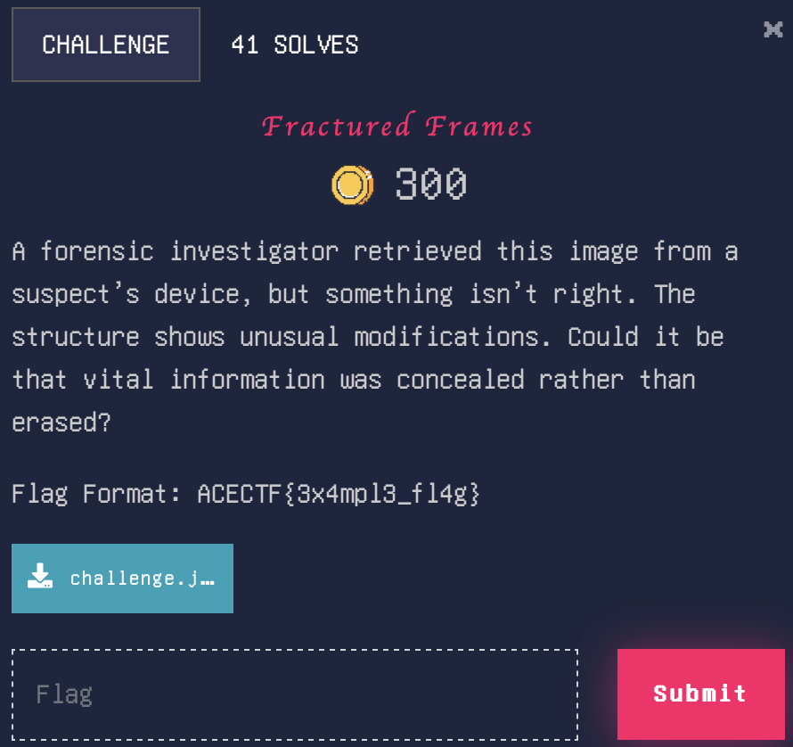

# Fractured frames

> Level: xxx || 300 points


## 1. Data

> Instruction



> Resource

A picture called 'challenge.jpg'.


## 2. Solution


We received a suspicious image that had hidden information within its structure. The hint suggested that the image wasn’t erased or encoded, but rather manipulated structurally.

&nbsp;
The first step in any forensics challenge is to gather basic information about the file. We start by running the `file` command and it tells us that the file is a JPEG image. This confirms that the file has not been completely changed to another format..

&nbsp;
Checking the Image Dimensions and Metadata using `exiftool` command :

```bash
$ exiftool challenge.jpg
```

Files aren't just text or visible images. They are stored as binary data (numbers). You can examine this data with `xxd` command:

```bash
$ xxd challenge.jpg | less
```

We look for the **Start of Frame (SOF0)** part, which indicates the image size. Normally, it looks like this:

```nginx
FF C0 00 11 08 01 15 00 B6 03 01
```
- 01 15 → Height: 0x115 (277 in decimal).
- 00 B6 → Width: 0xB6 (182 in decimal).

In your case, the image size is 0xB6 x 0xFF (182 x 255).

```nginx
FF C0 00 11 08 00 FF 00 B6 03 01
```

We're going to edit the file to set the correct value. To do this, we use hexedit :

```bash
$ hexeditor challenge.jpg
```

We search (^W) the marker `FF C0 00 11 08 00 FF 00 B6 03 01`.<br>
`08 00 FF` is replaced by `08 01 15`, restoring the correct height.


After modification, we open the image as usual (with a conventional image viewer). What's the result? The hidden part now appears, displaying the flag.


## 3. Flag

```plaintext
ACECTF{th1s_sh0uld_b3_en0u6h}
```