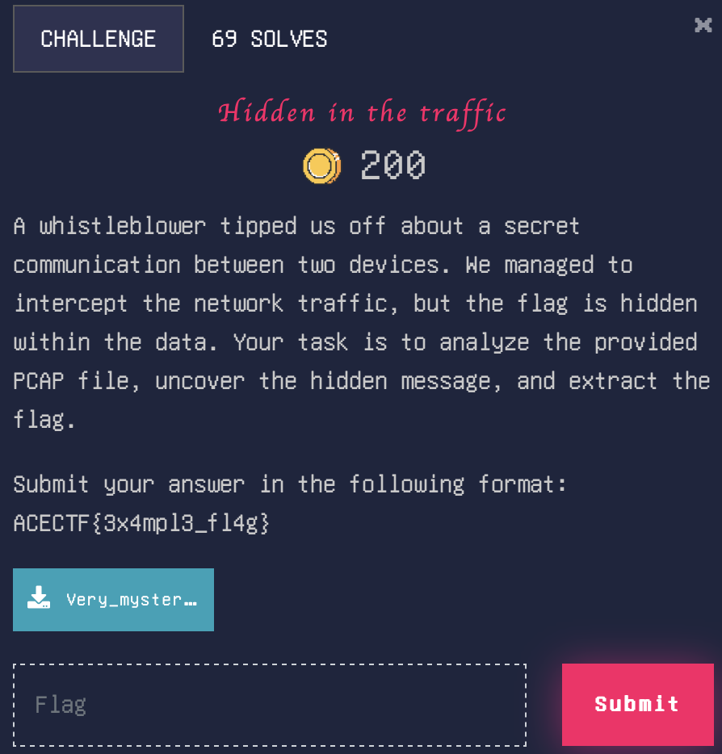

# Hidden in the traffic

> Level: xxx || 200 points


## 1. Data

> Instruction



> Resource

A PCAP file `Very_mysterious_file.pcapng`


## 2. Solution

Examining the PCAP file in Wireshark reveals some uninteresting DNS requests, QUIC traffic (used by some modern websites), TLS web communications, and a huge block of ICMP traffic. The user sent so many ICMP packets to the IP 8.8.8.8 (It is one of Google's public DNS servers) which is not usual and I'm thinking straight away of a death ping.


ICMP packets (type 8, corresponding to ping requests) contain a one-byte data payload. Using tshark, these data bytes can be extracted and converted to ASCII:


Inspecting filtered packets with [tshark](https://www.wireshark.org/docs/man-pages/tshark.html) (Terminal-oriented version of Wireshark). Each ICMP packet contains a flag letter.


- `-r Very_mysterious_file.pcapng`: Loads PCAP file.
- `-T fields -e data.data`: Extracts only useful data.
- `-Y 'icmp.type == 8'`: Filters ICMP type 8 packets (Ping Request).
- `xxd -r -p`: Converts hexadecimal to plain text.

Some characters resemble the structure of a flag (braces, underlined) and seem to be completed by a repeating string "*ABCDEFGHIJKL*” in uppercase. This can be removed with `sed` :

```bash
$ tshark -r Very_mysterious_file.pcapng -T fields -e data.data -Y 'icmp.type == 8' | xxd -r -p | sed s/ABCDEFGHIJKL//g
```


## 3. Flag

```plaintext
ACECTF{p1n6_0f_D347h}
```