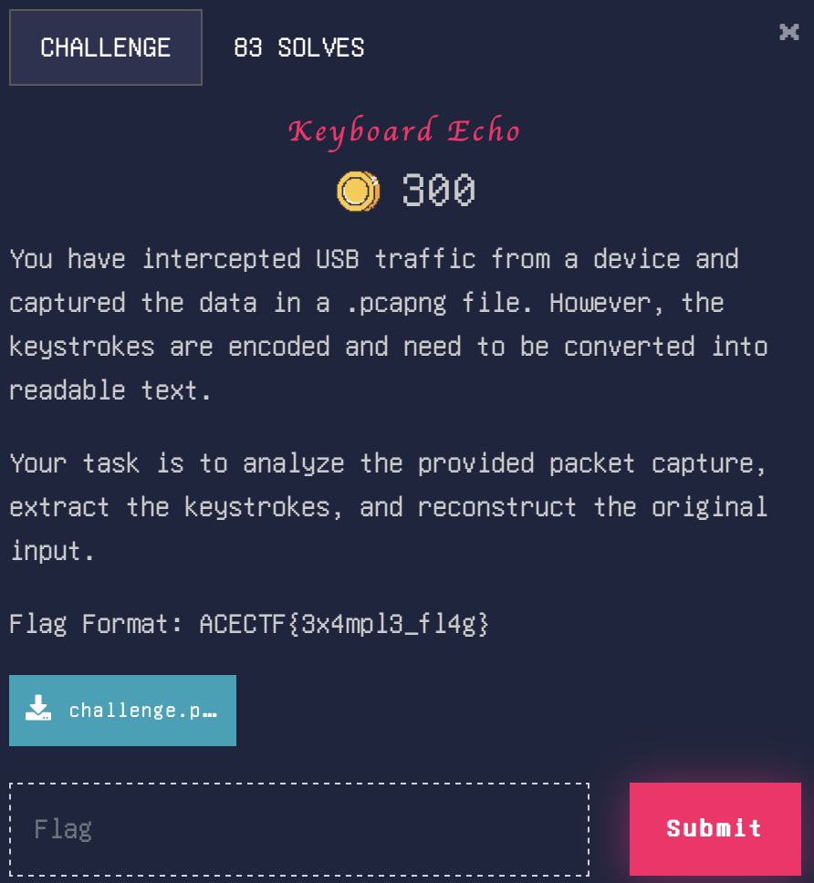

# Keyboard Echo

> Level: xxx || 300 points


## 1. Data

> Instruction



> Resource

A PCAP file `challenge.pcapng` (See Resource folder)


## 2. Solution

### Method 1: Using a tool to extract USB HID data from PCAP file

There is a fabulous tool available on Github called [USB Keyboard Parser](https://github.com/5h4rrk/CTF-Usb_Keyboard_Parser) that uses to extract the USB HID data from `.pcap` or `.pcapng` files.

So for using it, it's simple. Just download the tool from the above link and run the following command:

```bash
python3 Usb_Keyboard_Parser.py -f filename.pcap
```


### Method 2: Using Wireshark
First, we need to analyze the PCAP file with Wireshark.

```bash
wireshark challenge.pcapng
```
We can see that the PCAP file contains USB packets. We apply the `usb.capdata` filter to isolate USB HID data and show the keyboard input:


Each *Leftover Capture Data* field contains an 8-byte sequence. This represents the key pressed. The structure of USB keycodes generally follows the format :

```nginx
Modifier | Reserved | Keycode1 | Keycode2 | Keycode3 | Keycode4 | Keycode5 | Keycode6
```

So to interpret the sequence `04002b0000000000`:
- `04` is the modifier (e.g: Shift, Ctrl, Alt)
- `00` is the reserved field (always 0)
- `2b` is the first key pressed (keycode for the 'Shift' key)
- `00 00 00 00 00` no key pressed

This probably indicates that the Shift key was pressed at the same time.


### Method 3: Using Tshark
We can use Tshark to extract the USB HID data from the PCAP file.

```bash
tshark -r challenge.pcapng -Y "usb.capdata" -T fields -e usb.capdata
```

**Decoding Keycodes to Text**<br>
--
Source: https://github.com/tmk/tmk_keyboard/wiki/USB%3A-HID-Usage-Table
| Keycode (Hex) | Decimal | Character |
|---------------|---------|-----------|
| 1C           | 28      | y         |
| 27           | 39      | 0         |
| 18           | 24      | u         |
| 0B           | 11      | h         |
| 21           | 33      | 4         |
| 19           | 25      | v         |
| 20           | 32      | 3         |
| 09           | 9       | f         |
| 27           | 39      | 0         |
| 18           | 24      | u         |
| 11           | 17      | n         |
| 07           | 7       | d         |
| 1E           | 30      | 1         |
| 24           | 36      | 7         |


## 3. Flag

```plaintext
ACECTF{y0u_h4v3_f0und_17}
```