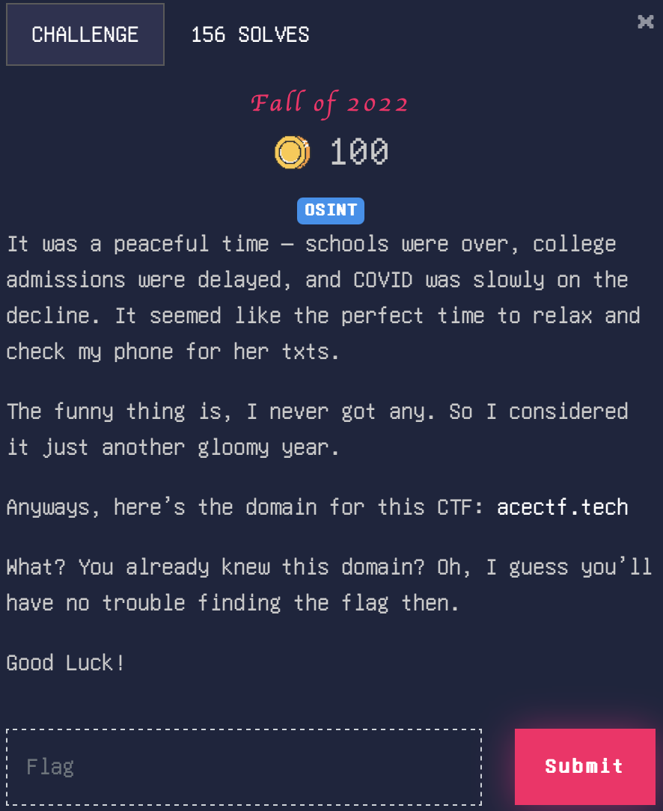

# Fall of 2022

> Level: xxx || 100 points


## 1. Data

> Instruction




## 2. Solution

The challenge provides the domain acectf.tech, as well as a hint in the challenge description: “perfect time to relax and check my phone for her txts.” This suggests that the flag may be hidden in the TXT records of the domain.

Using the `dig` command, we can query the TXT records of the domain:
 


or `nslookup`:

```bash
$ nslookup -type=TXT acectf.tech
```
This will output the domain's TXT records containing the flag.


## 3. Flag

```plaintext
ACECTF{y0u_g07_7h3_73x7}
```