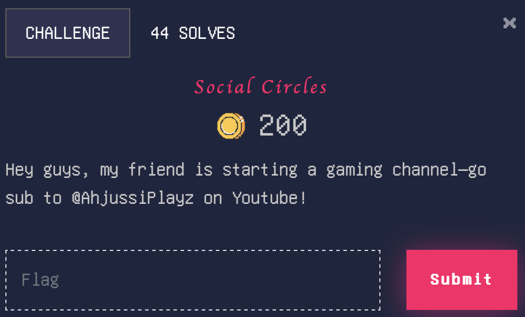

# Social Circles

> Level: xxx || 200 points


## 1. Data

> Instruction




## 2. Solution


For this challenge we were instructed to search for the YouTube channel "@AhjussiPlayz".


The channel has a single video entitled “New intro!”, which contains no useful information. However, the video transcript (Click on "Show transcript") contains a hidden message:


The transcript of the message is in English, and we have the Korean version available, so we change it for what it sounds like. The result is a Korean subtitle text generated using Google Translate.

```plaintext
PS 인트로 제작에 도움을 준 나의 좋은 친구 "wimebix884" 에게 큰 감사를 드립니다. 떠오르는 신예 가수, 그의 신곡을 만나보세요!
```

The message is a thank you to a friend named "*wimebix884*" who helped with the intro. The message also mentions a rising singer and his new song. We can assume that the singer's name is the flag.

We used [Sherlock](https://github.com/sherlock-project/sherlock), a Python-based OSINT tool capable of detecting the presence of accounts associated with a pseudonym across more than 400 websites. By searching for the username "wimebix884", we identified a linked Smule account.
<br>
> Other tools like [Blackbird](https://github.com/p1ngul1n0/blackbird) can also be used to search for the username across multiple platforms.

```bash
$ sherlock wimebix884
```
After testing multiple sites, we found that the username is available on [Smule](https://www.smule.com).<br>

And there it is! 'Flag Debauchery' leads us to a Google Drive folder containing an MP3 file. By listening to this file, we obtain the flag.


## 3. Flag

```plaintext
ACECTF{mu171m3d14_f146}
```