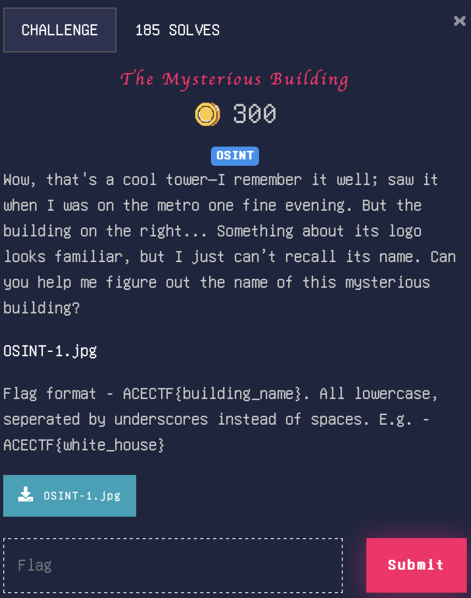

# The Mysterious Building

> Level: xxx || 300 points


## 1. Data

> Instruction



> Resource

A picture `OSINT-1.jpg`


## 2. Solution

There is an image provided, showcasing a building with a prominent logo on the top, as well as a tower in the background.
<br>Using exiftool on the image, we can see the description of the picture:


Googling New Delhi TV Tower (since New Delhi is India's national capital), I found this:


After some research from various angles, I discovered that the building.


The name of the building is : `PP TRADE CENTER`


## 3. Flag

```plaintext
ACECTF{pp_trade_center}
```
