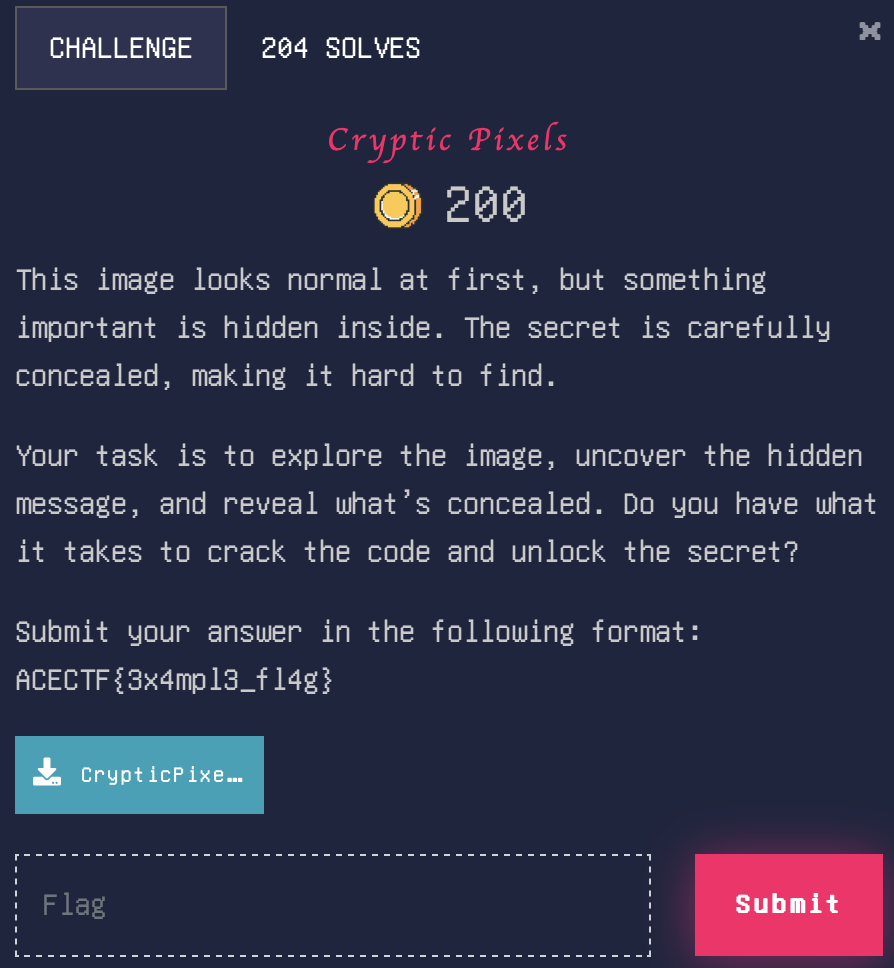

# Cryptic Pixels

> Level: xxx || 200 points


## 1. Data

> Instruction



> Resource

A picture file `CrypticPixels.png`


## 2. Solution

First, analyze the picture file with the `exiftool` command to see if there is any hidden information but nothing is found. Next, we use the `strings` command and find that there is a file **flag.txt** in the picture file. 


We extract the hidden file with the `binwalk` command. We can see a file **flag.txt** compressed in a Zip archive file **B8103.zip**. 


Then we access folder **_CrypticPixels.extracted**, the zipped file is protected by a password. We use the `zip2john` command to crack it. 

> Note: It's possible to use the `fcrackzip` command to crack the password.


Finally, we extract the file **flag.txt**. It contains a encrypted message in ROT Cipher. We decode it with https://www.dcode.fr/rot-cipher.


## 3. Flag

```plaintext
ACECTF{h4h4_y0u'r3_5m4r7}
```