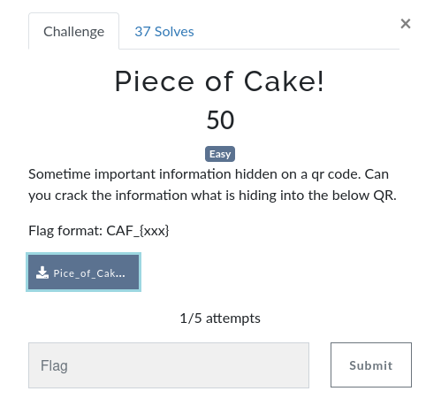

# Piece of Cake!

> Level: Easy || 50 points

## 1. Data

> Instruction



> Resource

A picture `Pice_of_Cake.png` (See Resources folder)


## 2. Solution


## 3. Flag
    
```text
CAF_{what_you_see_not_always_happen!}
```
