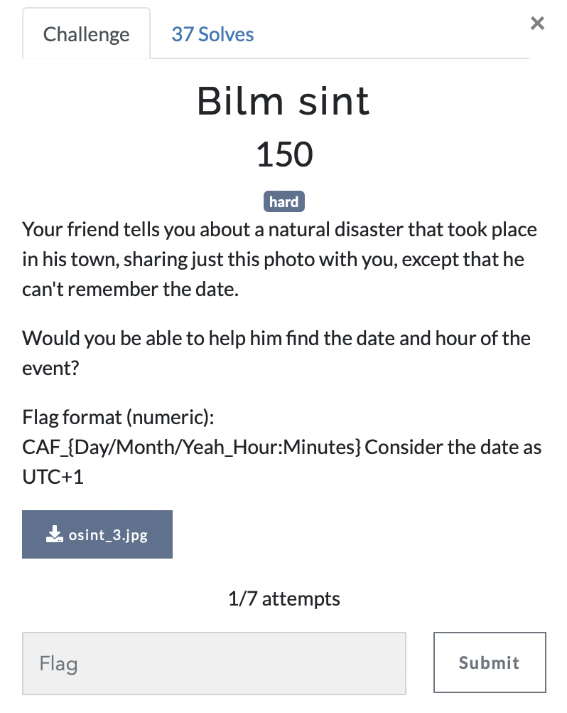

# Blim sint

> Level: Hard || 150 points

## 1. Data

> Instruction



> Resource

A picture `osint_3.jpg` (See Resources folder)


## 2. Solution


## 3. Flag
    
```text
CAF_{15/01/2024_07:00}
```
