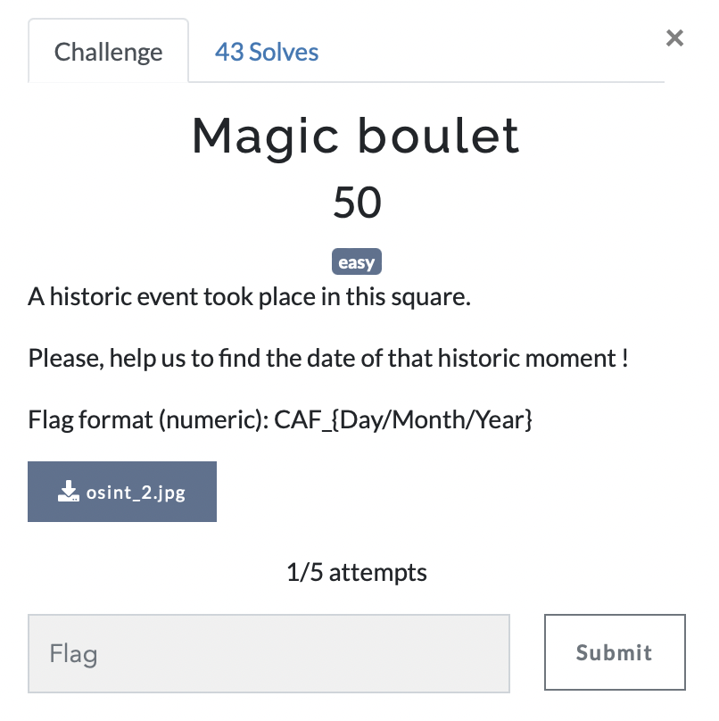

# Magic boulet

> Level: Easy || 50 points

## 1. Data

> Instruction



> Resource

A picture `osint_2.jpg` (See Resources folder)


## 2. Solution

Upload the picture via **Google Lens**. After analysis, this is the place related to the assassination of the thirty-fifth president of the United States: *John F. Kennedy (JFK)*. The date of the assassination is November 22, 1963.


## 3. Flag
    
```text
CAF_{22/11/1963}

```
