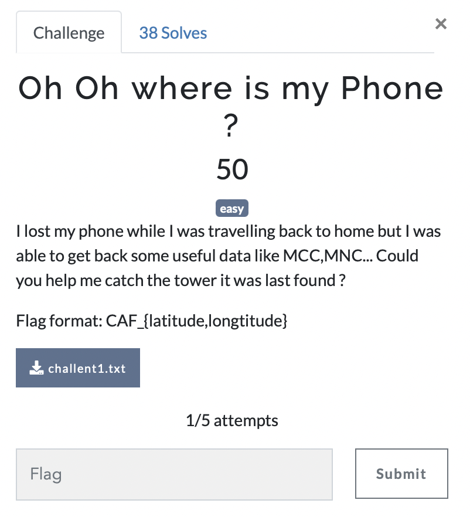

# Oh, oh where is my phone

> Level: Easy || 50 points

## 1. Data

> Instruction



> Resource

A text file `challent1.txt` (See Resources folder)


## 2. Solution


## 3. Flag
    
```text
CAF_{51.492359,-0.087228}
```
