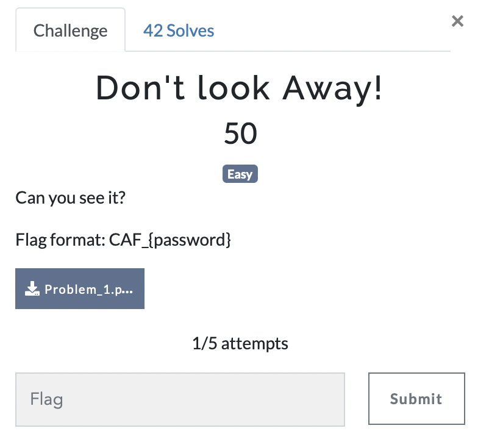

# Don't look Away

> Level: Easy || 50 points

## 1. Data

> Instruction



> Resource

A compiled python script `Problem_1.pyc` (See Resources folder)


## 2. Solution

For this challenge, we have a compiled python script when we run with the following command, the script requires a password so we will try to decompile to see the source code.<br>

```bash
$ python3 Problem_1.pyc
```

To decompile it, we can use `uncompyle6` package available via *pip install uncompyle6* but with his last we get a decompilation error about the python@3.11 version. After various online researchs, we have found the [lddgo](https://www.lddgo.net/en/string/pyc-compile-decompile) website who we have allowed to see partially the content of file.


After decompiling, we can see a *correct_password* variable. It's the flag.


## 3. Flag

```text
CAF_{Enter the password}
```
