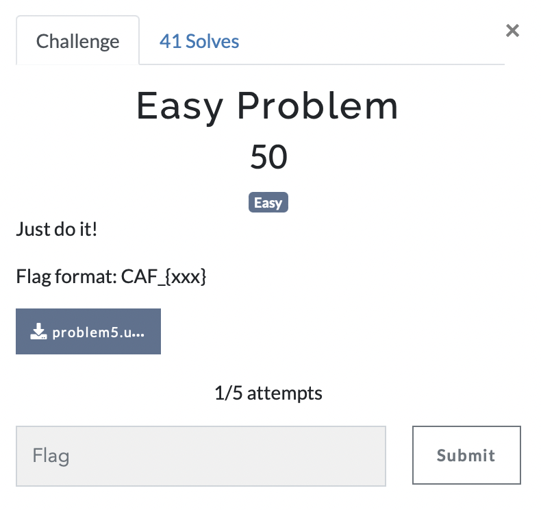

# Easy Problem

> Level: Easy || 50 points

## 1. Data

> Instruction



> Resource

A binary file `problem5.unknown` (See Resources folder)


## 2. Solution

The file `problem5.unknown` is a binary file. We can use the `strings` command to extract the strings from the file. 

```bash
$ strings problem5.unknown 
Error opening file: 
Error opening file for writing: 
Usage: 
 <filename> <key>
43 41 46 5F 7B 45 41 53 59 45 41 53 59 7D
hidden_
Text hidden successfully in the ELF file.
cannot create std::vector larger than max_size()
basic_string::_M_construct null not valid
vector::_M_realloc_insert
```

The output of the `strings` command shows the following strings:

* "hidden_" - This is a hint that the flag is hidden in the file.
* "Text hidden successfully in the ELF file." - This is another hint that the flag is hidden in the file. It also mentions an ELF file, which stands for Executable and Linkable Format, a common file format for executables, object code, shared libraries, and core dumps.
* "43 41 46 5F 7B 45 41 53 59 45 41 53 59 7D" - This is a  hexadecimal interessing string. We can convert this string to ASCII to get the flag.

To convert the hexadecimal string to ASCII, we can use an online dcode tool with `From Hex` operation or a Python script. Here is an example Python script to convert the hexadecimal string to ASCII:

```python
hex_string = "43 41 46 5F 7B 45 41 53 59 45 41 53 59 7D"
flag = ""

for hex_char in hex_string.split(" "):
    flag += chr(int(hex_char, 16))

print(f"Flag: {flag}")
```

## 3. Flag
    
```text
CAF_{EASYEASY}
```
