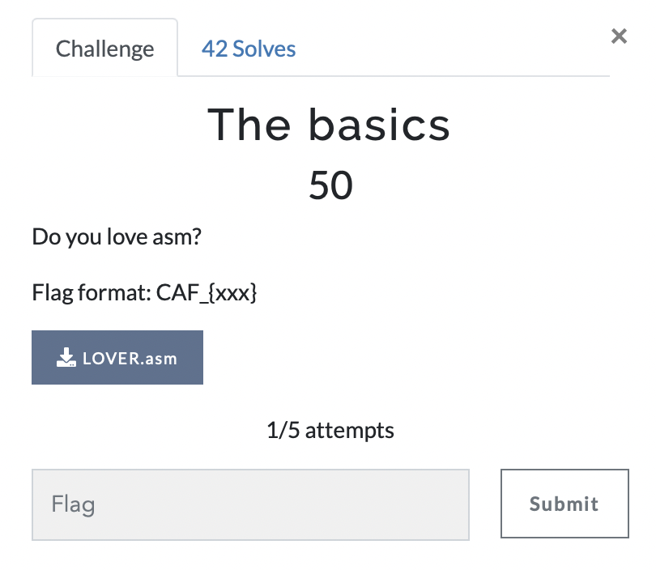

# The basics

> Level: Easy || 50 points

## 1. Data

> Instruction



> Resource

A assembler file `LOVER.asm` (See Resources folder)


## 2. Solution

In executing the `strings` command on the file `LOVER.asm` we get the following output:

```asm
section .data
hex_num1 DB 0x40, 0x23, 0x63, 0xa5, 0xbd, 0x52, 0x3c, 0x89, 0xac, 0x9f, 0x56, 0x85, 0x82 ;

hex_num2 DB 0x01, 0x70, 0x30, 0xe0, 0xf0, 0x10, 0x70, 0xd0, 0xe0, 0xd0, 0x00, 0xc0, 0xd0 ;

section .text
global _start

_start:
  mov eax, [hex_num1] ;
  mov ebx, [hex_num2] ;

  xor eax, ebx        ; 

  mov eax, 1          ;
  mov ebx, 0          ;
  int 0x80            ;
```

The code is simple, it loads the first address of the `hex_num1` and `hex_num2` arrays into the `eax` and `ebx` registers, respectively. Then, it performs an XOR operation between the values pointed to by `eax` and `ebx`, and stores the result in `eax`. Finally, it calls the `sys_exit` service to terminate the program.

To complete this challenge, you need to run the program and capture the output. You can use the following commands to assemble and run the program:

```bash
$ nasm -f elf32 LOVER.asm -o LOVER.o
$ ld -melf_i386 LOVER.o -o LOVER
$ ./LOVER
$ echo $?
```

When you run the program, it will output the result of the XOR operation. The result is `0x41`, which is the ASCII value for the character `A`. You can convert the result to ASCII using an online tool or a Python script.<br><br>
Example decoding script:

```python
hex_num1 = [0x40, 0x23, 0x63, 0xa5, 0xbd, 0x52, 0x3c, 0x89, 0xac, 0x9f, 0x56, 0x85, 0x82]
hex_num2 = [0x01, 0x70, 0x30, 0xe0, 0xf0, 0x10, 0x70, 0xd0, 0xe0, 0xd0, 0x00, 0xc0, 0xd0]

result = ""

for i in range(len(hex_num1)):
    result += chr(hex_num1[i] ^ hex_num2[i])

print(result)
```


## 3. Flag
    
```text
CAF_{ASSEMBLYLOVER}
```
