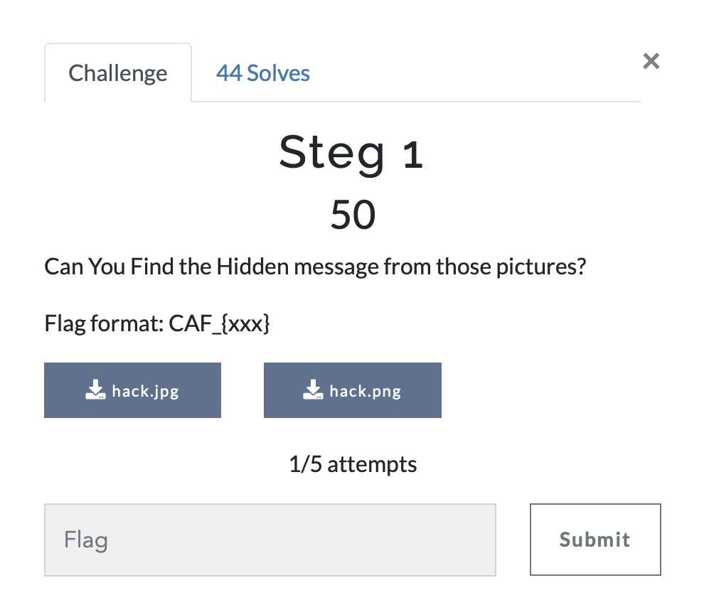

# Steg 1

> Level: Easy || 50 points

## 1. Data

> Instruction



> Resource

Two images : `hack.jpg` and `hack.png` (See Resources folder)

## 2. Solution

Utilizing the [zsteg](https://github.com/zed-0xff/zsteg) tool, we extracted text embedded in the image `hack.png`, we successfully uncovered the initial segment of the flag.


Next, we employed the *steghide* tool on the second file `hack.jpg`. Since it required a passphrase, we utilized *stegseek* with the dictionary `rockyou.txt` to discover the passphrase and acquire the second part of the flag.


## 3. Flag

```text
CAF_{Crack_If_You_Can}

```
