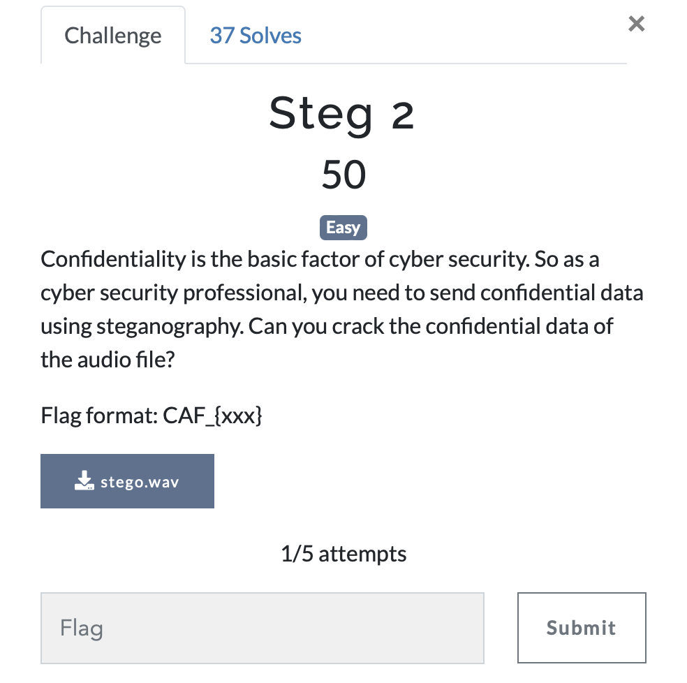

# Steg 2

> Level: Easy || 50 points

## 1. Data

> Instruction



> Resource

A audio file `stego.wav` (See Resources folder)


## 2. Solution


## 3. Flag
    
```text
CAF_{WHY_ARE_YOU_USING_SONIC_VISUALISER?}
```
