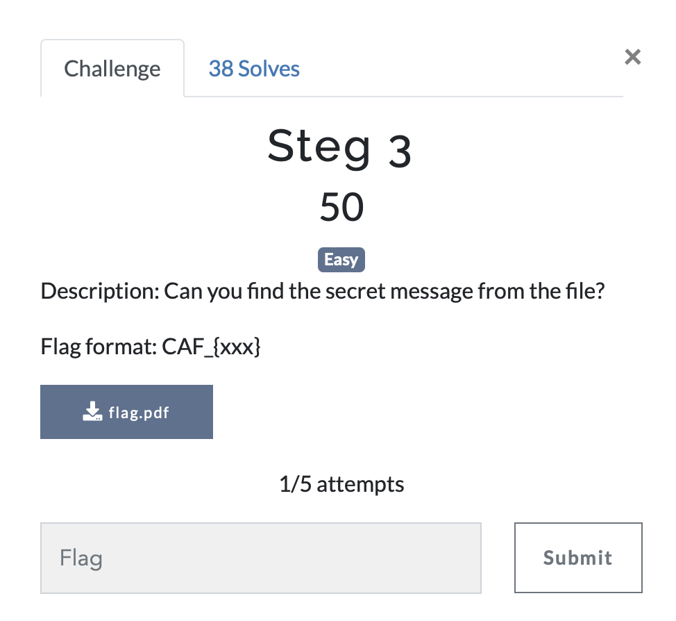

# Steg 3

> Level: Easy || 50 points

## 1. Data

> Instruction



> Resource

A pdf file: `flag.pdf` (See Resources folder)


## 2. Solution
To solve this challenge, we need to use the tool `exiftool` to extract metadata from the image `flag.pdf`. We can see that there is a comment in the metadata that contains a base58 encoded string. We can decode this string to get the flag.


## 3. Flag

```text
CAF_{Metadata_Can_Erased}
```

