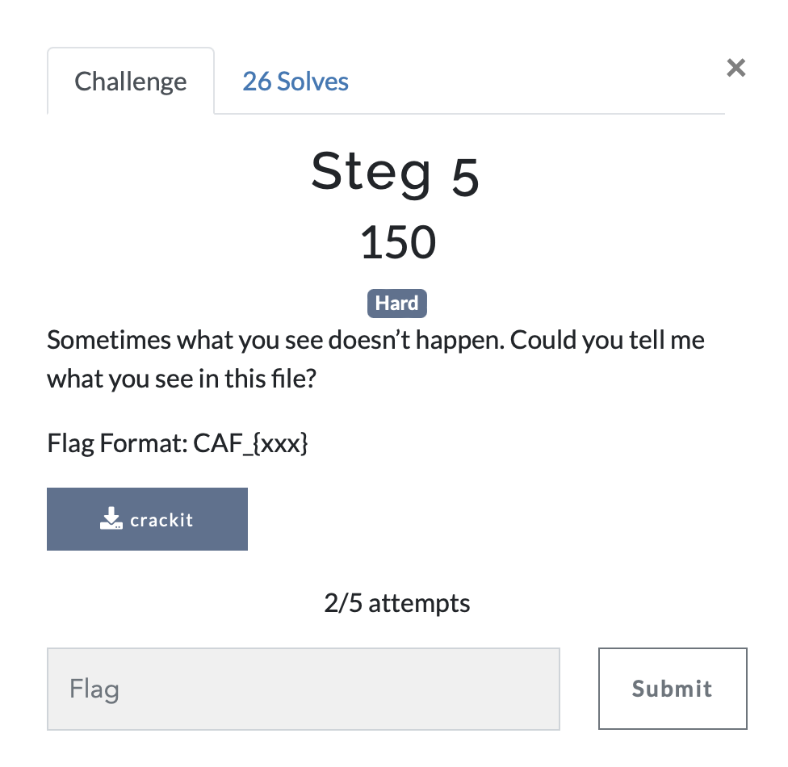

# Steg 5

> Level: Hard || 150 points

## 1. Data

> Instruction



> Resource

A file: `crackit` (See Resources folder)

## 2. Solution
To solve this challenge, we will proceed in a methodical way to find the flag.

### Step 1: Check the file type

We will use the `file` command to check the file type.

```bash
$ file crackit
crackit: data
```

The output tells us that it is a data file.

### Step 2: Check the file content with `strings` command

We get a lot of data, but a string seems like encoded data.

```text
..................................rpu0L*629P0*@F0v@E0%960u=28N................................
```
So let's try to decode it using [CyberChef](https://gchq.github.io/CyberChef/). CyberChef is a powerful tool that can be used to decode/encode data. I used the `ROT47` operation to decode the string.


## 3. Flag

```text

CAF_{Yeah!_You_Got_The_Flag}

```

