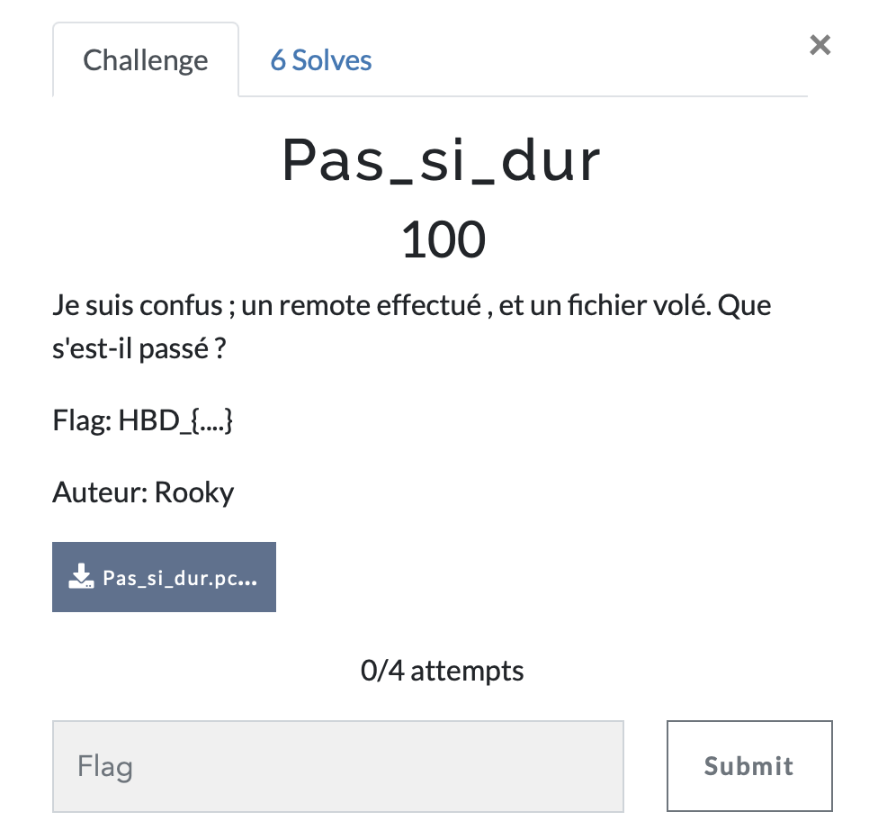

# Pas si dur

> Level: xxx || 100 points

## 1. Data

> Instruction



> Resource

A capture file `Pas_si_dur.pcapng` (See Resources folder)


## 2. Solution
To solve this challenge, we will use Wireshark to analyze the pcap file. 
```bash
$ wireshark Pas_si_dur.pcapng
```

We can see that the pcap file contains a lot of DNS communication. We can filter the packets to see only the HTTP packets. There is a python file that is downloaded from the server. We can extract the file exporting the object from the HTTP packets.
Go in File Tab -> Export Objects -> HTTP -> Save

Reading the content script, we can see a base64 encoded string but it inverted. We inverted it and decode it with the following commands on the picture below. Finally we get the flag. 


## 3. Flag
    
```
    HBD_{run_s4n1ty_run}
```
