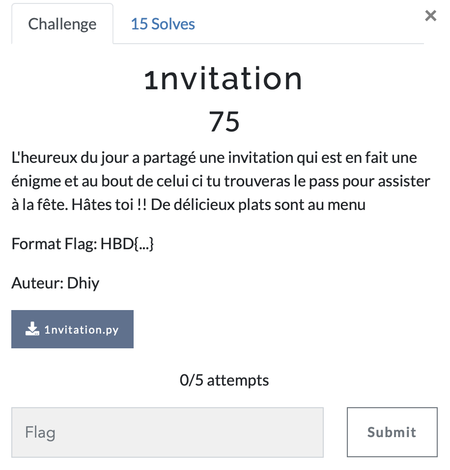

# 1nvitation

> Level: xxx || 75 points

## 1. Data

> Instruction



> Resource

A python script `1nvitation.py` (See Resources folder)


## 2. Solution

The file is a simple python script, we can open it and read the content.


The script is a simple Caesar cipher with a key that is not defined. But we have a *output* variable at the end of the script who is the result of the encryption of the text with the key. This result is a crypted string. With more visual analysis of *output* variable, we can see that it has been encrypted with a **1 offset encryption**.

The table below shows the offset of each letter of the alphabet by 1

|| A| B|C | D| E| F| G|H | I| J| K| L|M |N | O| P| Q| R| S| T| U| V|W | X| Y| Z||<br>
||--|--|--|--|--|--|--|--|--|--|--|--|--|--|--|--|--|--|--|--|--|--|--|--|--|--||<br>
|| B| C| D| E| F| H| I| J| K| L| M| N| O|P | Q| R| S| T| U| V| W| X| Y|Z | A| B||<br>

So by identification with this table, we get the flag or a quicker way is to use the [dcode](https://www.dcode.fr/chiffre-decalages) online tool to decrypt the string.


## 3. Flag
    
```
HBD{Cyb3r41_l0_p3r3}
```
