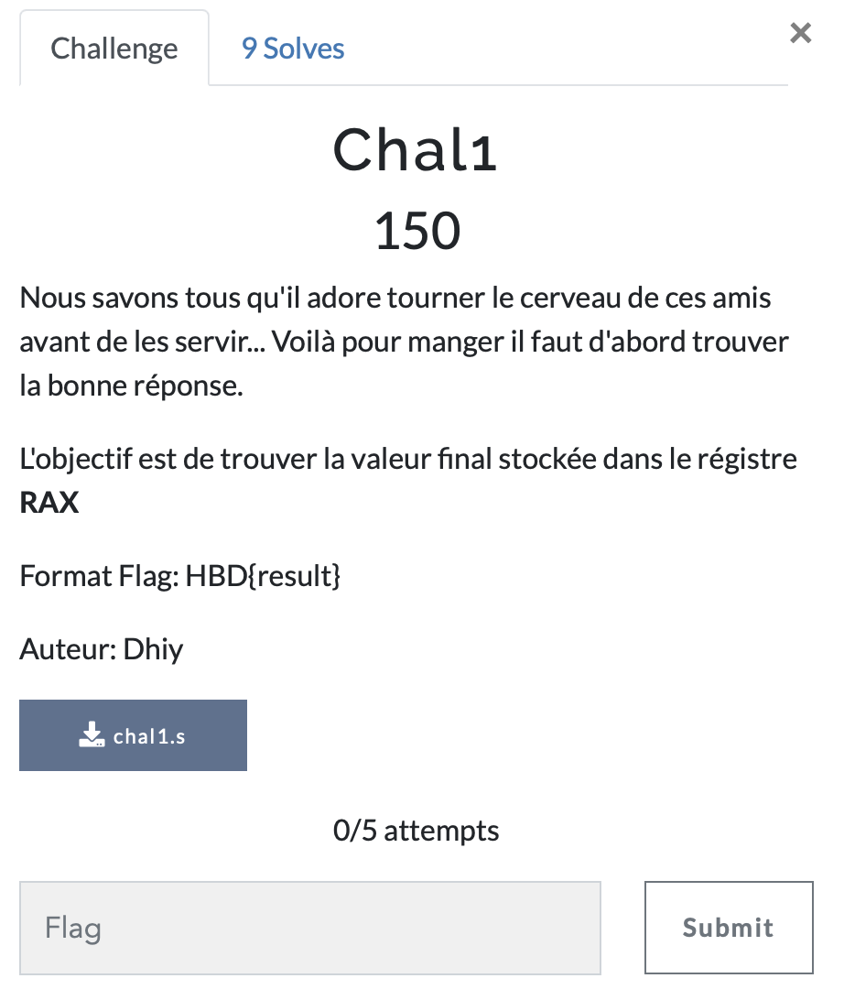

# Chal 1

> Level: xxx || 150 points

## 1. Data

> Instruction



> Resource

A file `chal1.s` (See Resources folder)


## 2. Solution

The content of file is a simple assembly code.

```bash
$ cat chal1.s
#########################
# mov    $0xa,%eax      #
# add    $0x14,%rax     #
# sub    $0x5,%rax      #
# imul   $0x3,%rax,%rax #
# idiv   %rax           #
# mov    %rax,%rbx      #
# add    $0xa,%rbx      #
# mov    %rbx,%rax      #
# mov    %rax,%rdi      #
# mov    $0x3c,%eax     #
# xor    %rdi,%rax      #
#########################
```
I found this challenge easy, you just need a little knowledge of Assembler and that's it....

To determine the final value of rax at the end of execution, we need to follow the instructions sequentially.

- Line 1: eax is loaded with the value 0xa. eax then becomes 0xa.
- Line 2: Adds 0x14 to the rax value. rax becomes 0x14 + 0xa = 0x1e.
- Line 3: Subtracts 0x5 from the rax value. rax becomes 0x1e - 0x5 = 0x19.
- Line 4: Multiplies the value of rax by 0x3.
rax becomes 0x19 * 0x3 = 0x51.
- Line 5: Divides the rax value by itself. This statement may result in division by zero, which may cause an exception or undefined behavior. However, in this context, let's assume that no exceptions occur. Dividing rax by itself gives 1.
- Line 6: Copies the value of rax to rbx. rbx becomes 1.
- Line 7: Adds 0xa to the value of rbx. rbx = 1 + 0xa = 0xb.
- Line 8: Copies the value of rbx to rax. rax = 0xb.
- Line 9: Copies the value of rax to rdi. rdi = 0xb.
- Line 10: Load the value 0x3c into eax.
eax becomes 0x3c.
- Last line (line 11): Performs an XOR operation between rdi and rax. rax becomes 0x3c XOR 0xb = 0x37.
So at the end of execution, the value of rax is `0x37`.

Now let's convert the hexadecimal number 0x37 to its decimal value.

In hexadecimal, each number represents a power of 16, going from right to left.

Converting this to decimal we have:

- `3` * 16^1 + `7` * 16^0 = 3 * 16 + 7 * 1 = 48 + 7 = 55.

So the decimal value of 0x37 is 55.

## 3. Flag
    
```
HBD{55}
```
