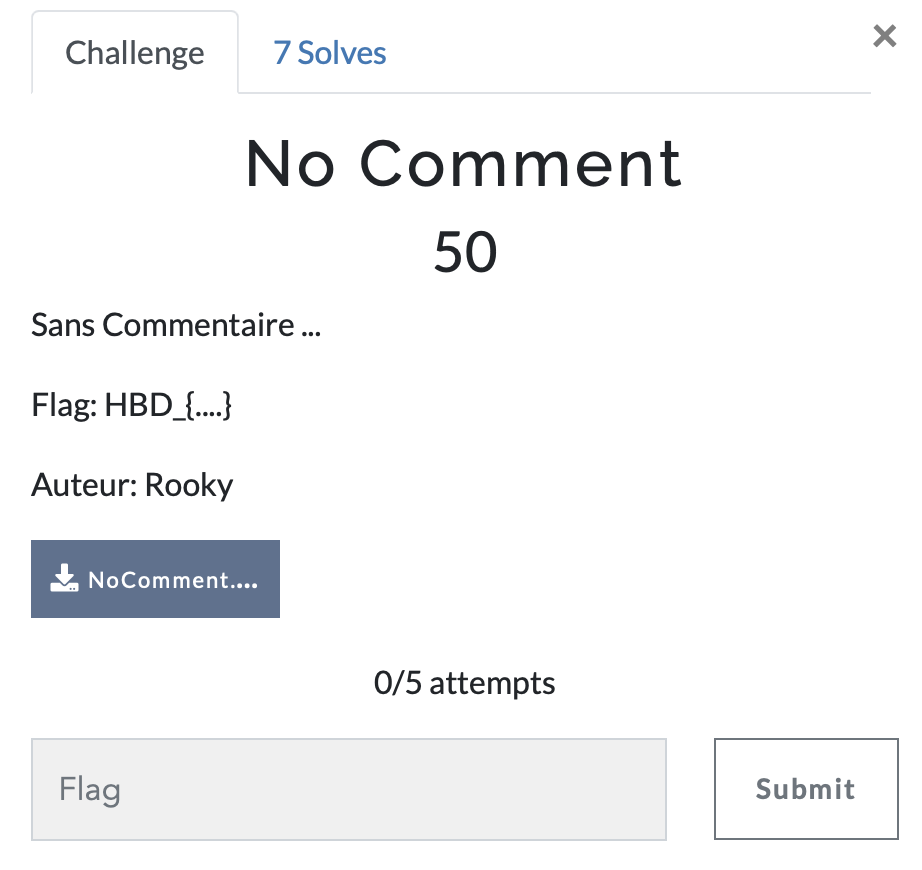

# No comment

> Level: xxx || 50 points

## 1. Data

> Instruction



> Resource

A file `NoComment.jpeg.jpg` (See Resources folder)


## 2. Solution
To solve this challenge, we can use the `strings` or `exiftool` command to extract the text from the image.

```bash
$ strings NoComment.jpeg.jpg
```
This will give us a lot of information about the image, but we can see a interesting encoded string in the output.

```bash
=4CIpUXZwBib1BicldmbhJnchdCbgIXavZXZkBychZHI1RHIpz2bzlORoAiVVljUYNzczMlR5oUTEVUMYBjUJ1UM5EVT6NGMNRFZm5EVGFWU6VkemFVP9AiOgM3chBHIlNGIjVmdhBSZnFWbpBSZ0RXZjBycuFGZgcWYsZGIlxGIlZXdvJHd
```
This string is base64 encoded but inverted. Once again, we have an inverted encoded string. To decode it, we can invert it again and decode it using the `echo` command in the following screen.


The resulting character string is encoded in ROT13. We can decode it using different tools like [CyberChef](https://gchq.github.io/CyberChef/) or [dcode](https://www.dcode.fr/chiffre-rot-13).


Without using any of these tools, we can use the `tr` command to decode the string because the JPEG format is based on ASCII characters.

```bash
$ echo "UOQ_{7H_I015_DH3_P37417_51ZC13}" | tr 'A-Za-z' 'N-ZA-Mn-za-m'
```


## 3. Flag
    
```
HBD{7U_V015_QU3_C37417_51MP13}
```
