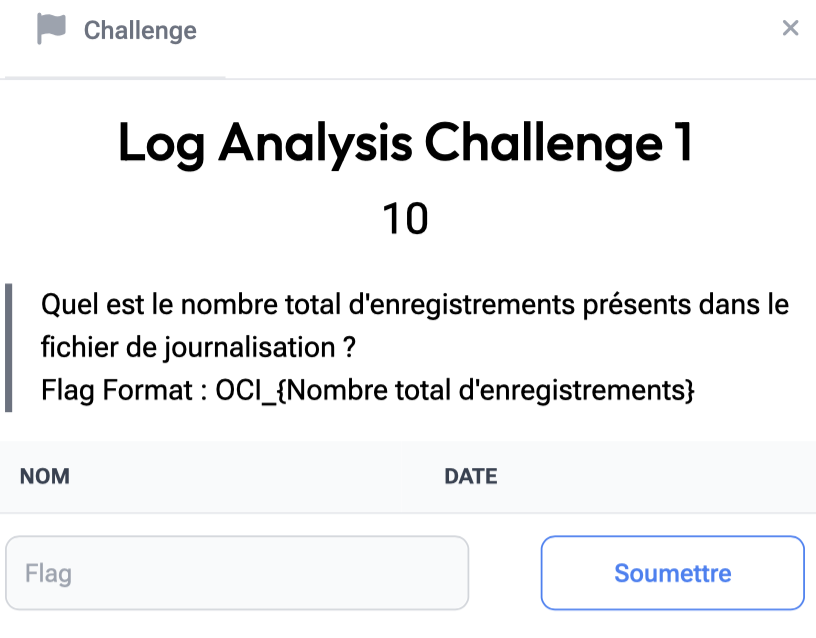

# Log Analysis 1

> Level: xxx || 10 points


## 1. Data

> Instruction




## 2. Solution


To determine the total number of records in the log file, we'll use a simple and effective approach with the `wc` (word count) command. Here are the steps:

1. Access the file, making sure that the log file is in our current working directory.
2. Count the lines


The -l option counts the number of lines in the file


## 3. Flag

```text
OCI_{10000}
```
