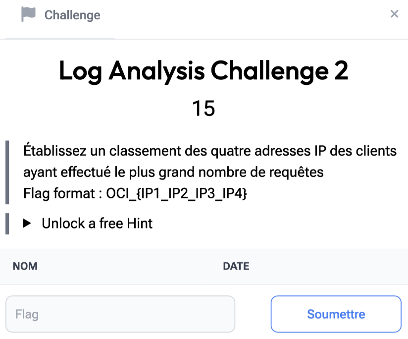

# Log Analysis 2

> Level: xxx || 15 points


## 1. Data

> Instruction



> Resource

A log file `challenge_1_access.log` (See the “Log Analysis 1” challenge Resource folder)


## 2. Solution

To solve this challenge, our first reflex is to identify the file structure. It contains HTTP logs in classic Apache format, with information such as IP address, HTTP method, requested path and return code.
&nbsp;


Here are the steps:

- Extracting IP addresses: We can see that the first column designates IP addresses. We use `awk` to extract them.
- Counting occurrences: We use `sort` and `uniq -c` to count how many times each IP appears.
- Sorting results: We sort the IP addresses by frequency in descending order (as indicated in the hint).
- Selecting the first four: We display the first four most frequent IP addresses with `head`.


```bash
awk '{print $1}' challenge_1_access.log | sort | uniq -c | sort -nr | head -n 4
```


## 3. Flag

```text
OCI_{172.104.16.7_172.104.16.87_172.104.16.80_172.104.16.68}
```
