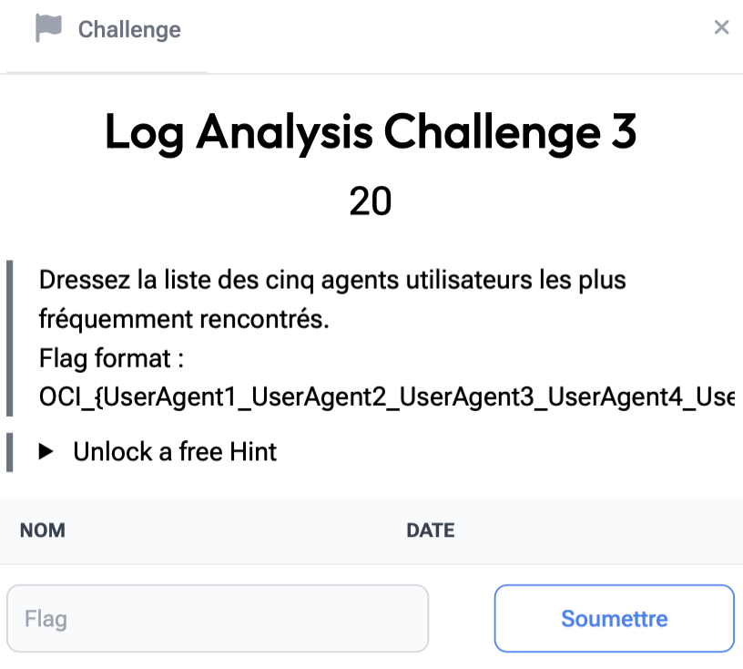

# Log Analysis 3

> Level: xxx || 20 points


## 1. Data

> Instruction



> Resource

A log file `challenge_1_access.log` (See the “Log Analysis 1” challenge Resource folder)


## 2. Solution

To solve this challenge, we're going to extract User-Agent information from the logs. This information can be found in the last column of entries.

&nbsp;

**Steps :**

1. User-Agent extraction: We use `awk -F'"' '{print $6}'` with `"` as a delimiter to extract the last column of the file.
2. Counting occurrences: With `sort` and `uniq -c`, we count how many times each User-Agent appears in the logs.
3. Sorting results: We use `sort -rn` to sort the results in descending order.
4. Select the top five most frequent User-Agents with `head -n 5`.


## 3. Flag

```text
OCI_{python-requests/2.28.2_Mozilla/5.0 (Macintosh; Intel Mac OS X 10_15_7) AppleWebKit/605.1.15 (KHTML, like Gecko) Version/14.0.3 Safari/605.1.15_Mozilla/5.0 (iPhone; CPU iPhone OS 14_2 like Mac OS X) AppleWebKit/605.1.15 (KHTML, like Gecko) Version/14.0 Mobile/15E148 Safari/604.1_Mozilla/5.0 (Windows NT 10.0; Win64; x64) AppleWebKit/537.36 (KHTML, like Gecko) Chrome/91.0.4472.124 Safari/537.36_Mozilla/5.0 (Linux; Android 9; Pixel 3 XL Build/PQ3B.190705.003) AppleWebKit/537.36 (KHTML, like Gecko) Chrome/76.0.3809.111 Mobile Safari/537.36}
```
