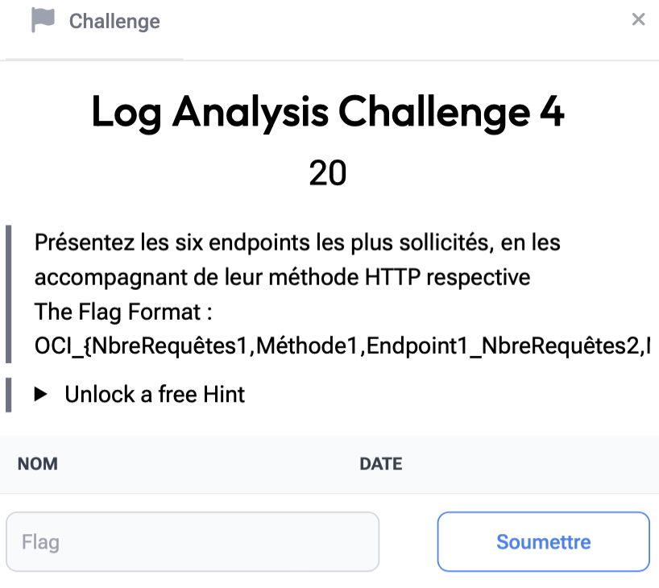

# Log Analysis 4

> Level: xxx || 20 points


## 1. Data

> Instruction



> Resource

A log file `challenge_1_access.log` (See the “Log Analysis 1” challenge Resource folder)


## 2. Solution

Always starting from the same log file structure, we'll proceed as follows to identify the most frequent HTTP Method + Endpoint combinations.

```bash
awk -F'"' '{print $2}' challenge_1_access.log | awk '{print $1, $2}' | sort | uniq -c | sort -nr | head -n 6
```

**Command explanation:**

1. `awk -F'“‘ ’{print $2}'` : HTTP methods and endpoints are located in the columns after the first pair of quotation marks (”)
2. `awk '{print $1, $2}'` : Separates and displays only the HTTP method and endpoint
3. `sort`: Sorts combinations alphabetically
4. `uniq -c` : Counts how many times each method + endpoint combination appears in logs
6. `sort -nr` : Combinations are sorted by frequency in descending order
7. `head -n 6` : Displays the six most frequent combinations


## 3. Flag

```text
OCI_{598,POST,/app/admin/dashboard.jsp_581,TRACE,/app/admin/dashboard.jsp_579,PUT,/app/admin/login.jsp_578,POST,/app/admin/login.jsp_574,PUT,/app/admin/dashboard.jsp_574,DELETE,/app/admin/dashboard.jsp}```
