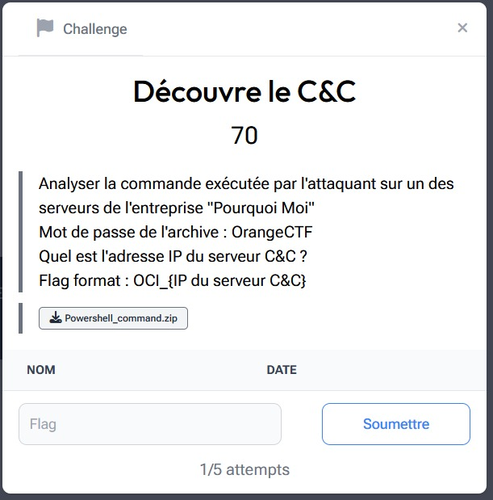

# Découvre le C&C

> Level: xxx || 70 points


## 1. Data

> Instruction



> Resource

A zipped file : `Powershell_command.zip` (See Resource folder)


## 2. Solution

To begin with, we decompress the archive using the password *OrangeCTF*. We obtain a `Powershell_command.txt` file. We analyze the contents with the `strings` command to see if there is any sensitive information.

At first glance, we notice an obfuscated PowerShell script running in the background (hidden). One detail in particular catches our eye: the use of the `-encodedCommand` option. This is often used to hide malicious commands. This alerts us to the possibility that this script may be dangerous.


To find out more about the nature of the file, we analyze it on [VirusTotal](https://www.virustotal.com/) , a fabulous online tool which allows us to detect whether a file is malicious thanks to numerous antivirus engines, and also to visualize the network relationships it may have with remote servers. We found that the file was indeed considered malicious, as it was detected by 30 out of 63 antivirus engines.


We took our analysis a step further by consulting VirusTotal's *RELATIONS* tab. We discover that the script establishes a connection with a unique IP address located in the United States (US).


<br>
🚨**Make sure you open the file on a Linux virtual machine, as Windows will automatically delete it if you try to view its contents.** 🚨

## 3. Flag

```text
OCI_{54.174.203.61}
```
