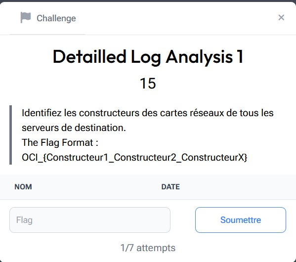

# Detailled Log Analysis 1

> Level: xxx || 15 points


## 1. Data

> Instruction



> Resource

Log file `challenge_2_access.log` (See Resource folder)


## 2. Solution

I opened the log file and noticed that it was a log file from a web server. The aim of this challenge is to find the MAC manufacturers of the devices that have connected to the server. So I wrote a Bash script called `script_macvendors.sh` to extract the MAC addresses from the log file and use an [API](https://api.macvendors.com/) to identify the manufacturer of a device from its MAC address.


## 3. Flag

```text
OCI_{Broadcom_HUAWEI}
```


