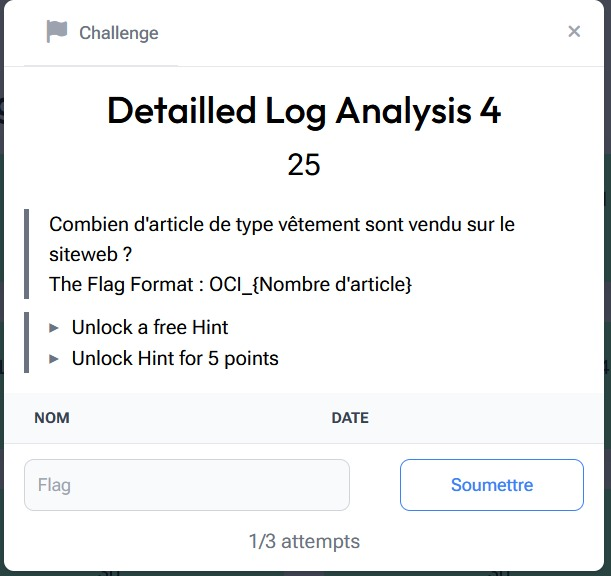

# Detailled Log Analysis 4

> Level: xxx || 25 points


## 1. Data

> Instruction



> Resource

A log file containing interactions with a website's API `challenge_2_access.log` (See “Detailled Log Analysis 1” in the challenge Resources folder)


## 2. Solution

Analysis of the log file reveals a request to the endpoint :

```json
{
        "timestamp": "2023-03-10T07:18:37",
        "src": {
          "ip": "106.212.28.153",
          "MAC": "10-0D-7F:38:03",
          "hostname": "user3402.netlocal.corp"
        },
        "dst": {
          "ip": "10.20.75.28",
          "mac": "7C-1C-F1:3C:4D:5F",
          "hostname": "kong.netcorp.local"
        },
        "endpoint": "/app/articles",
        "method": "GET",
        "response": "eyIxIiA6ICJvcmFuZ2UiLCAiMiIgOiAicG9tbWUiLCAiMyIgOiAibWFuZ3VlIiwgIjQiIDogInRzaGlydCIsICI1IiA6ICJwYW50YWxvbiIsICI2IiA6ICJjaGVtaXNlIiwgIjciIDogInJvYmUiLCAiOCIgOiAic2FjIiwgIjkiIDogImNoYWlzZSIsICIxMCIgOiAidGFibGUiLCAiMTEiIDogImFtcG91bGUiLCAiMTIiIDogImNvdXNzaW4iLCAiMTMiIDogImZhdXRlaWwiLCAiMTQiIDogIm9yZGluYXRldXIiLCAiMTUiIDogInRhc3NlIiwgIjE2IiA6ICJ2ZXJyZSJ9",
        "status": 200,
        "user": {
          "session_id": "8215c777-e2ec-4576-864f-e3c0eb9e9a82",
          "info": {
            "name": "Mathilda",
            "login": "user3402"
          }
        }
      },
```

The returned response appears to be an object encoded in [Base64](https://cyberchef.org/#recipe=From_Base64('A-Za-z0-9%2B/%3D',true,false)&input=ZXlJeElpQTZJQ0p2Y21GdVoyVWlMQ0FpTWlJZ09pQWljRzl0YldVaUxDQWlNeUlnT2lBaWJXRnVaM1ZsSWl3Z0lqUWlJRG9nSW5SemFHbHlkQ0lzSUNJMUlpQTZJQ0p3WVc1MFlXeHZiaUlzSUNJMklpQTZJQ0pqYUdWdGFYTmxJaXdnSWpjaUlEb2dJbkp2WW1VaUxDQWlPQ0lnT2lBaWMyRmpJaXdnSWpraUlEb2dJbU5vWVdselpTSXNJQ0l4TUNJZ09pQWlkR0ZpYkdVaUxDQWlNVEVpSURvZ0ltRnRjRzkxYkdVaUxDQWlNVElpSURvZ0ltTnZkWE56YVc0aUxDQWlNVE1pSURvZ0ltWmhkWFJsYVd3aUxDQWlNVFFpSURvZ0ltOXlaR2x1WVhSbGRYSWlMQ0FpTVRVaUlEb2dJblJoYzNObElpd2dJakUySWlBNklDSjJaWEp5WlNKOQ). Decoding it, we obtain :

```json
{"1" : "orange", "2" : "pomme", "3" : "mangue", "4" : "tshirt", "5" : "pantalon", "6" : "chemise", "7" : "robe", "8" : "sac", "9" : "chaise", "10" : "table", "11" : "ampoule", "12" : "coussin", "13" : "fauteil", "14" : "ordinateur", "15" : "tasse", "16" : "verre"}
```

The items corresponding to clothes are: **tshirt**, **pantalon**, **chemise**, **robe**. That's a total of 4 clothing items.


## 3. Flag

```text
OCI_{4}
```


