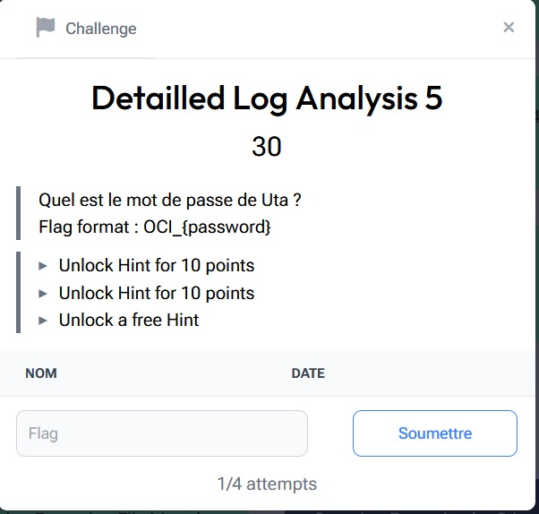

# Detailled Log Analysis 5

> Level: xxx || 30 points


## 1. Data

> Instruction



> Resource

A log file `challenge_2_access.log` (See “Detailled Log Analysis 1” in the challenge Resources folder)


## 2. Solution

The challenge is to find **Uta**’s password by analyzing the logs of a web server, looking for traces of authentication.  

In the Linux environment, this information is generally stored in the `/etc/shadow` and `/etc/passwd` files. If a successful request to these files appears in the logs, we can extract their contents.  

To make log analysis easier, we use **jq**, a tool for efficiently manipulating data in JSON format. A web version of this tool exists: [jqplay](https://jqplay.org/).

With the above command, we look for successful requests to all endpoints containing the word "shadow".

```bash
jq '.logs[] | select.(.status == 200 and (.endpoint  | contains("shadow"))) '  challenge_2_access.log
```
Explanation: 
- `.status == 200` → The request was successful
- `.endpoint | contains(“shadow”)` → The target endpoint contains “shadow”, which means that an attempt was made to access the /etc/shadow file


The result is as follows:


In the “response” field of the logs, we find the server response. This response is base64 encoded, so we're going to use CyberChef to exploit it.


Bingo! We've recovered the **hash** of **Uta**'s password. It begins with **"y ”**, indicating a hash with **yescrypt**. We save it in a `uta` file and use **John the Ripper** with a `--format=crypt` dictionary attack to try to break it.


In a few seconds, **John the Ripper** reveals **Uta**'s plaintext password.


## 3. Flag

```text
OCI_{pasaway}
```
