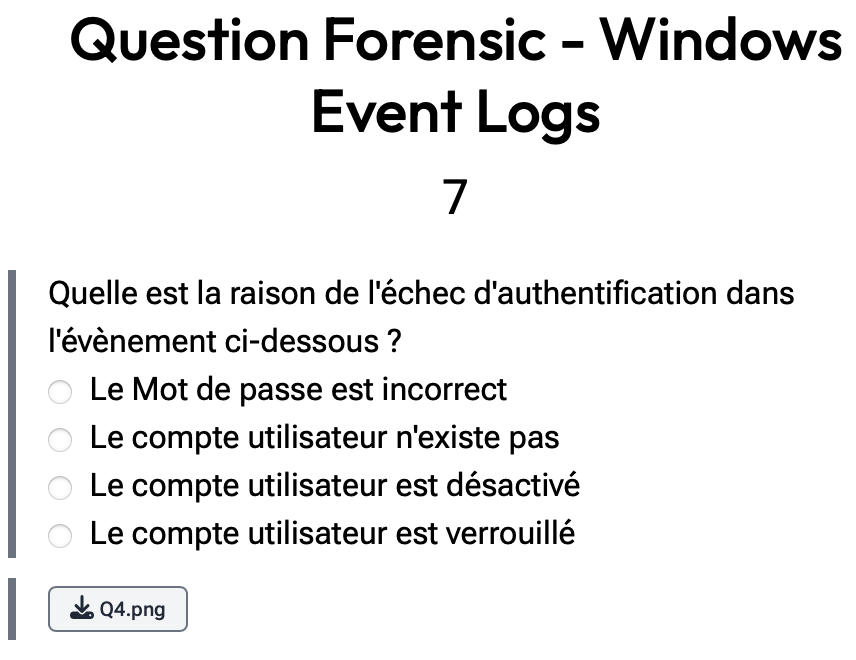

# Windows Event Logs

> Level: xxx || 7 points

## 1. Data

> Instruction

> Resource

A picture `Q4.png` (See Resources folder)

## 2. Solution

From the information given in the image `Q4.png` we can see that:
- Event code: 4776
- Authentication Package: "MICROSOFT_AUTHENTICATION_PACKAGE_V1_0"
- Error code: 0xC000006A

So we use the website [Ultimate Windows Security](https://www.ultimatewindowssecurity.com/securitylog/encyclopedia/event.aspx?eventid=4776)

## 3. Answer

The correct answer is **`Le mot de passe est incorrect`**

