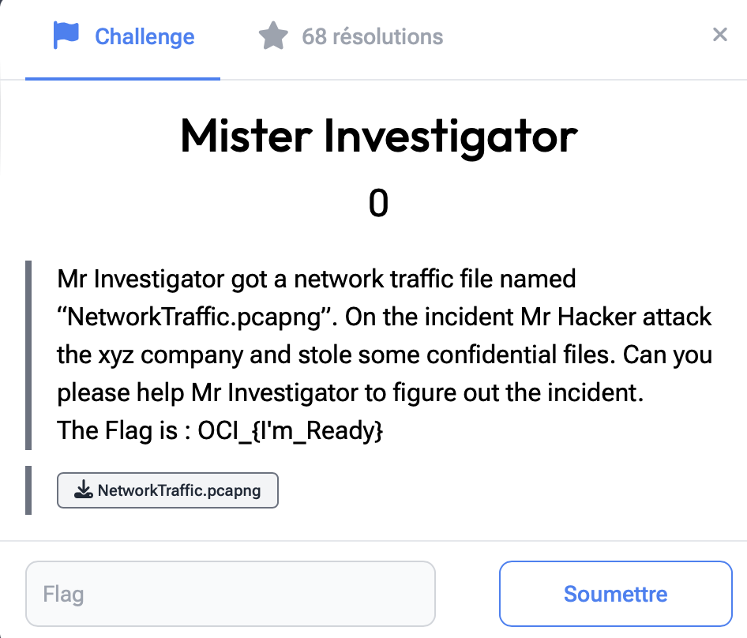

# Mister Investigator

> Level: xxx || 0 point


## 1. Data

> Instruction




## 2. Solution

The flag is given directly in the instruction. It's a sort of starting point for the other challenges


## 3. Flag

```text
OCI_{I'm_Ready}
```