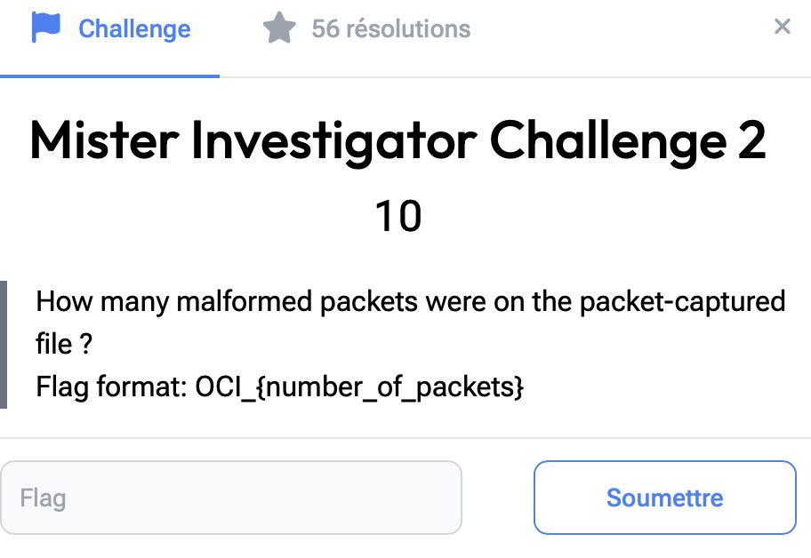

# Mister Investigator 2

> Level: xxx || 10 points


## 1. Data

> Instruction




## 2. Solution


Any challenge involving a PCAP file can be solved in one of two ways.

1. **Method with Wireshark**

After opening the *NetworkTraffic.pcapng* file in Wireshark, simply enter **`_ws.malformed`** or **`malformed`** in the filter bar. Alternatively, you can navigate to the “Statistics > Protocol Hierarchy > Transmission Control Protocol” tab and consult the Telnet section to obtain the number of malformed packets.


2. **Method with Tshark**

Tshark, the command-line version of Wireshark, offers powerful features for filtering, extracting and analyzing network data. Using a simple command, you can quickly obtain the number of malformed packets.

```bash
tshark -r NetworkTraffic.pcapng -Y "_ws.malformed" | wc -l
```

Explanation of options
- -r: This option means “read” an existing capture file
- -Y : This option is used to apply a display filter
- wc -l : It will count the number of lines in the output


## 3. Flag

```text
OCI_{2}
```
