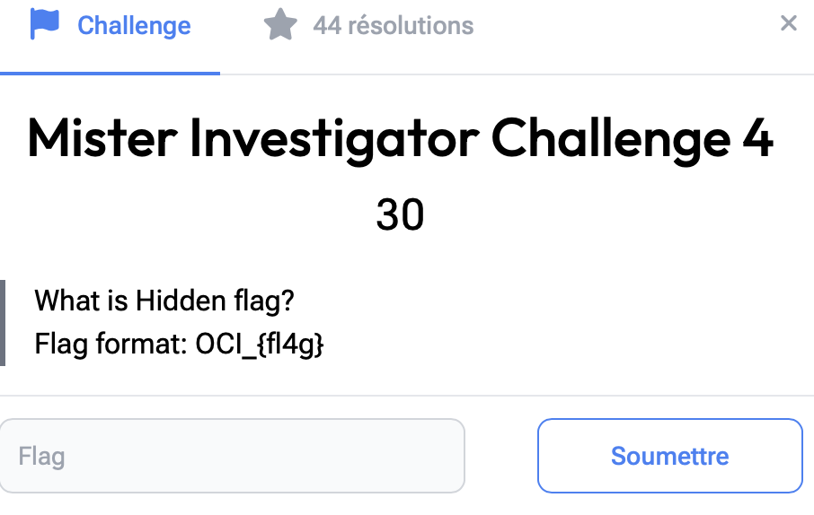

# Mister Investigator 4

> Level: xxx || 30 points


## 1. Data

> Instruction




## 2. Solution


The resolution of this challenge is similar to that of *Mister Investigator Challenge 5*. By analyzing TCP streams in Wireshark, we discovered a base64-encoded string in the `secret.txt` file:
**`ZmxhZ3s3aDFua18wdTdfMGZfN2gzX2IweH0=`**, which decodes into a false flag: *flag{7h1nk_0u7_0f_7h3_b0x}*.

This false flag has given us a clue to explore in greater detail the network navigations carried out by the *allstuck* user. We can see that he has read the contents of the `very_secret.txt` file, which reads **`>T%*,@+&4!X<YX]w4&=!4g13Evme=#gq@'<Hk57?m:Cw2`**.


Decoding with our favorite online tool [CyberChef](https://gchq.github.io/CyberChef/#recipe=From_Base92()From_Base64('A-Za-z0-9%2B/%3D',true,false)&input=PlQlKixAKyY0IVg8WVhddzQmPSE0ZzEzRXZtZT0jZ3FAJzxIazU3P206Q3cy). The string is encoded in two formats: first base92, then base64.


## 3. Flag

```text
OCI_{73ln3t_15_n07_53cur3}
```
