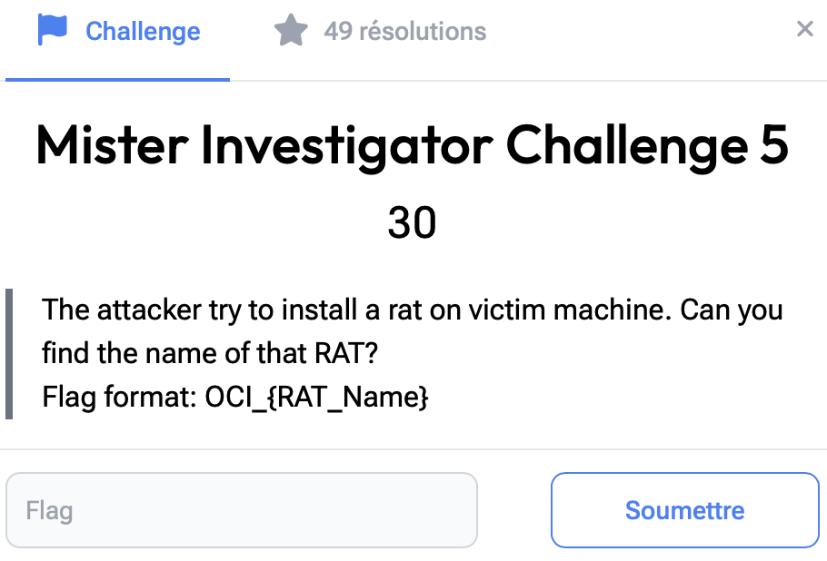

# Mister Investigator 5

> Level: xxx || 30 points


## 1. Data

> Instruction




## 2. Solution

On opening Wireshark we find out there are multiple UDP, TCP & SSH Packets.

Let’s apply the first hack in the forensics wireshark playbook. Follow the TCP Stream (Select a TCP Packet and press `Ctrl+ Alt + Shift + T`). By following the TCP flow, we can see the contents of the `secret.txt` file, containing text encoded in base 64: **ZmxhZ3s3aDFua18wdTdfMGZfN2gzX2IweH0=**.
<br>Let’s decrypt it: flag{7h1nk_0u7_0f_7h3_b0x}


Just below, we can see the link to a Github repo. Accessing it via the browser, the *Readme.md* file describes it as a cross-platform RAT tool.


## 3. Flag

```text
OCI_{pupy}
```
