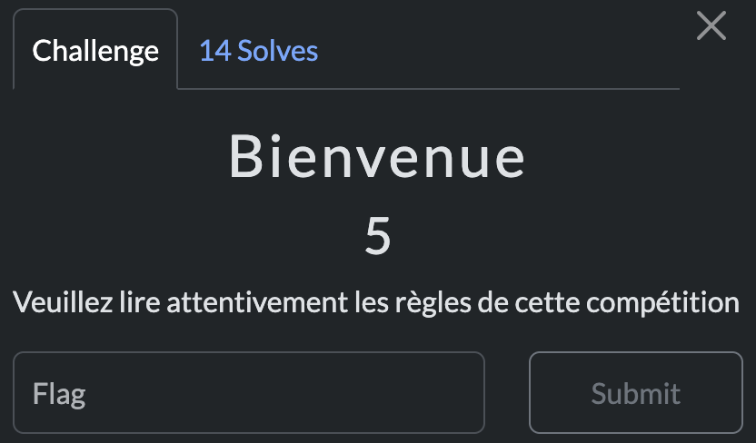

# Basic

> Level: xxx || 5 points


## 1. Data

> Instruction




## 2. Solution

Checking the source code of the `Rules` page, we can see a comment with the flag.


## 3. Flag

```plaintext
SDICTF{bb7c6de54ccded66a02e49b7c00538ada24ca415}
```