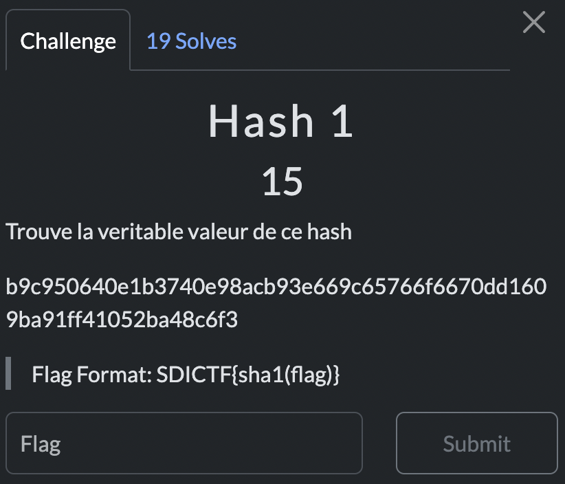

# Hash 1

> Level: xxx || 15 points


## 1. Data

> Instruction




## 2. Solution

Use [hashes.com](https://hashes.com/en/decrypt/hash) to decrypt the hash. It is a SHA256 hash.


The password is `password1234`. Hash it with [SHA1](http://www.sha1-online.com/) to get the flag.


## 3. Flag

```plaintext
SDICTF{e6b6afbd6d76bb5d2041542d7d2e3fac5bb05593}
```