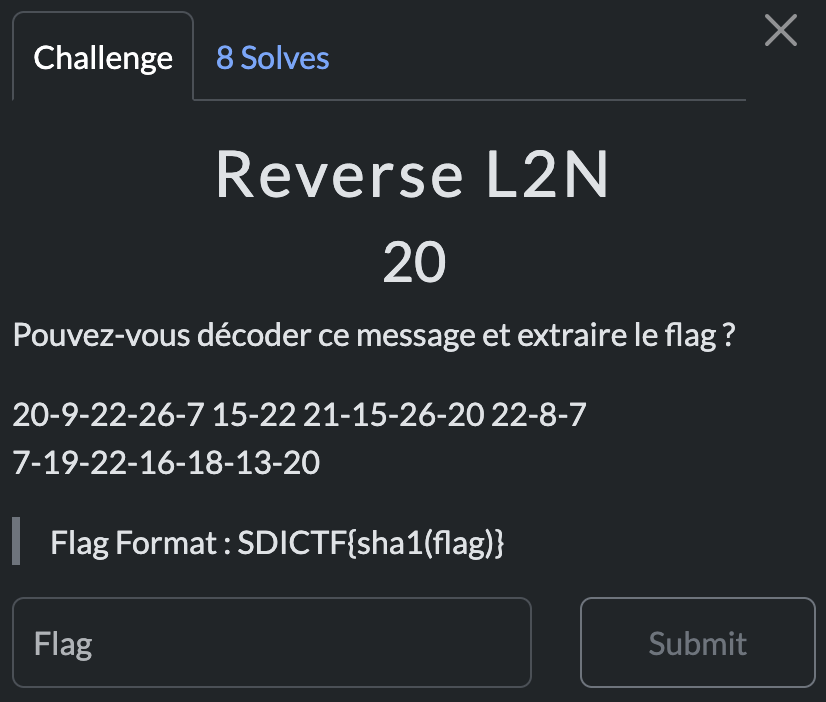

# Reverse L2N

> Level: xxx || 20 points


## 1. Data

> Instruction




## 2. Solution


The title `Reverse L2N` gives a big hint! It is about doing an inverse operation, so "Number to Letter" (N2L) while converting the numbers to letters in reverse alphabetical order to get the flag. That is to say:
- 1 → Z,
- 2 → Y,
- ...,
- 26 → A.


So we have to write a Python script to solve this challenge


We get the flag `theking`. For the final flag, we need to hash the flag with [SHA1](http://www.sha1-online.com/).


## 3. Flag

```plaintext
SDICTF{b4f283414a963c09f49cfde4a5eeba9752196247}
```