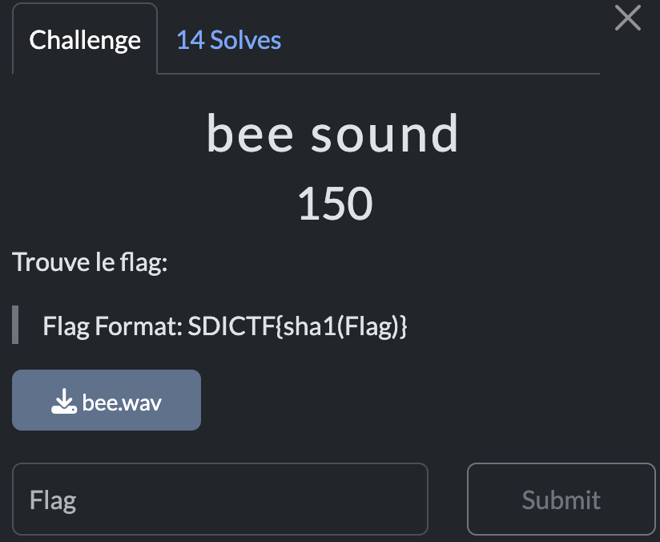

# Bee sound

> Level: xxx || 150 points


## 1. Data

> Instruction



> Resource

A sound file `bee.wav`


## 2. Solution

The sound file `bee.wav` contains a hidden message. To extract the message, we can use the tool [Sonic Visualiser](https://sonicvisualiser.org) or [Spectral Analysis Dcode](https://www.dcode.fr/spectral-analysis) or [Morse Code Adaptive Audio Decoder](https://morsecode.world/international/decoder/audio-decoder-adaptive.html) to visualize the sound file.

The message written is **BarCodeFlag**. It is in plain text, so we can read it directly. Don't forget to convert the flag to [SHA1](http://www.sha1-online.com/) hash before submitting it.


## 3. Flag

```plaintext
SDICTF{202c6d6577c331151e37b83baf68566f4235a643}
```