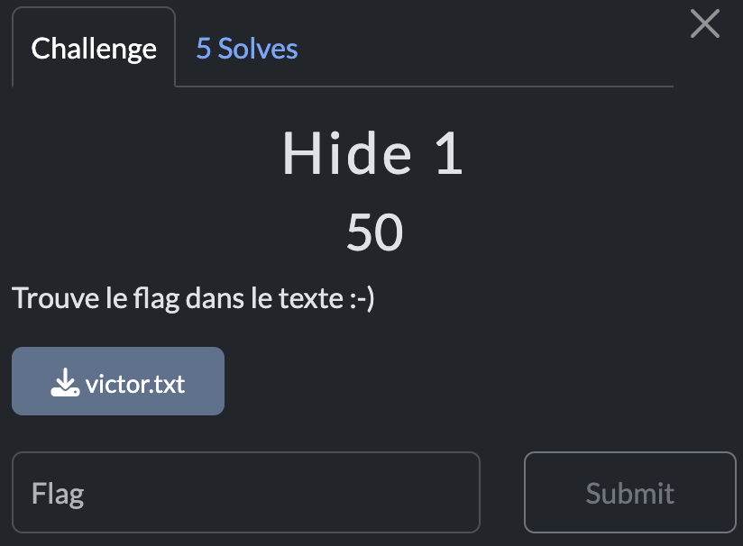

# Hide 1

> Level: xxx || 50 points


## 1. Data

> Instruction



> Resource

A text file `victor.txt` is provided for download.


## 2. Solution


Upon opening the file to be analyzed, nothing interesting is found at first glance. The absence of visible information suggests that hidden data could be concealed there.

A first classic approach is to use the `strings` command to extract printable character strings from the file. However, in this case, the command returns nothing useful, which may indicate the use of a specific steganography technique.


&nbsp;
One possible method is zero-length steganography, which involves hiding data in invisible spaces, such as special Unicode characters or non-printable spaces. To check this, we use an [online tool](https://330k.github.io/misc_tools/unicode_steganography.html) that allows us to extract hidden data from text files.
 


And bingo! we get the flag.


## 3. Flag

```plaintext
SDICTF{53c5b76c2f7a37a917f7df086b0cc012e0de86f0}
```