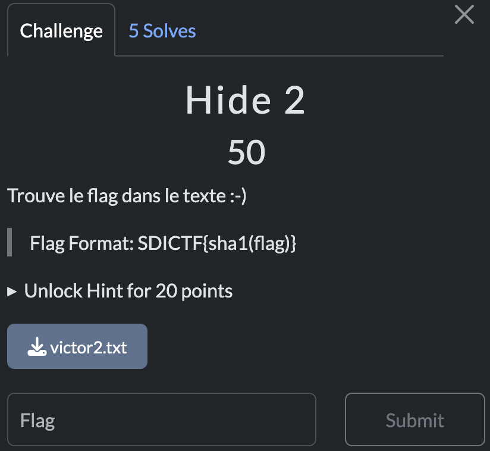

# Hide 2

> Level: xxx || 50 points


## 1. Data

> Instruction



> Resource

A text file `victor2.txt`

> Hint (I didn't use it)


## 2. Solution

On opening the file, I realized that the text it contained looked as if it had undergone some kind of processing (a text stegnography technique).

I used the following [tool] (https://holloway.nz/steg/) to extract the hidden message.


The extracted message is: `twitter_flag` which is the flag but hashed with [SHA1](https://www.sha1-online.com/).<br>

=> Note: https://securityaffairs.com/24681/hacking/steganography-tweet.html
<br>


## 3. Flag

```plaintext
SDICTF{f247ffde107489a174e72d63bcbd872937b39614}
```
