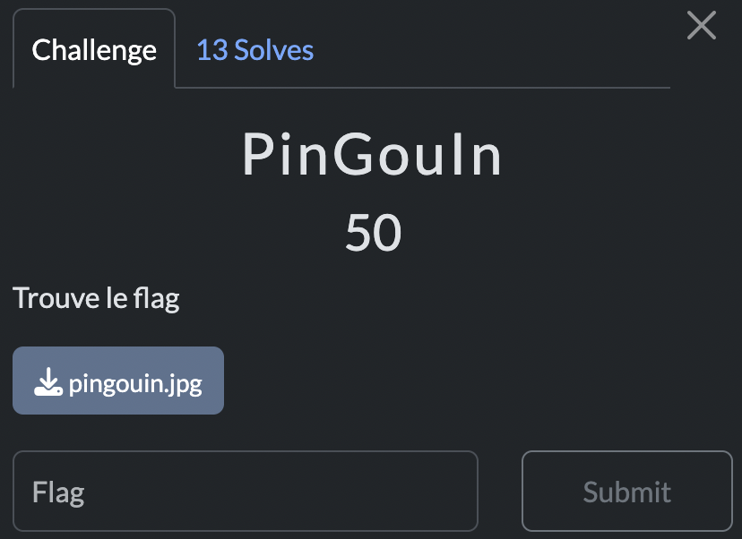

# PinGouIn

> Level: xxx || 50 points


## 1. Data

> Instruction



> Resource

A picture `pingouin.jpg`


## 2. Solution


Open the image `pingouin.jpg` with an image viewer. 

```bash
xdg-open pingouin.jpg
```

You will see a penguin. However, if you look closely, you will see that there is a string of characters written backwards and hidden in the image. To extract the hidden text, you can use the `stegsolve` tool with the `Full Red` option. You will see the hidden text in the image.


## 3. Flag

```plaintext
SDICTF{cd2ef12270d8fe03919295ee96132d4783579646}
```
