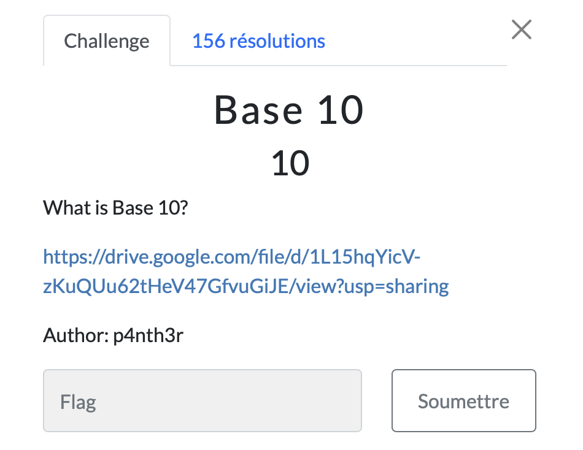

# Base 10

> Level: xxx || 10 points

## 1. Data

> Instruction



> Resource

A [python file](https://drive.google.com/file/d/1L15hqYicV-zKuQUu62tHeV47GfvuGiJE/view?usp=sharing) available via a Drive link

## 2. Solution

Use [dcode](https://cyberchef.org/#recipe=From_Decimal('Space',false)&input=ODQgMTA0IDExNyAxMTAgMTAwIDEwMSAxMTQgNjcgMTA1IDExMiAxMDQgMTAxIDExNCAxMjMgNzAgMTA4IDk3IDcxIDk1IDg0IDQ4IDk1IDY2IDUyIDExNSA1MSA5NSA0OSA0OCAxMjU) to solve this challenge by choosing the `From Decimal` operator.


## 3. Flag
    
```
ThunderCipher{FlaG_T0_B4s3_10}
```

