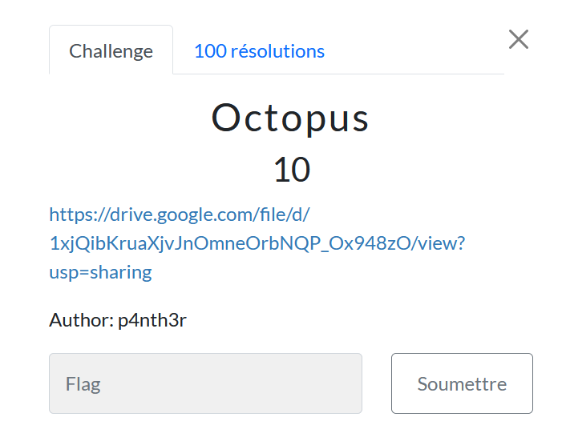

# Octopus

> Level: xxx || 10 points

## 1. Data

> Instruction



> Resource

A [text file](https://drive.google.com/file/d/1xjQibKruaXjvJnOmneOrbNQP_Ox948zO/view?usp=sharing) available via a Drive link

## 2. Solution

Use [Cyberchef](https://cyberchef.org/#recipe=From_Octal('Space')&input=MTI0IDE1MCAxNjUgMTU2IDE0NCAxNDUgMTYyIDEwMyAxNTEgMTYwIDE1MCAxNDUgMTYyIDE3MyA2MCAxNDMgMTY0IDY0IDExNCAxMzcgMTI2IDY0IDE1NCAxNjUgNjMgNDEgNzUgNzUgMTc1) to solve this challenge by choosing the `From Octal` operator.


## 3. Flag
    
```text
ThunderCipher{0ct4L_V4lu3!==}
```

