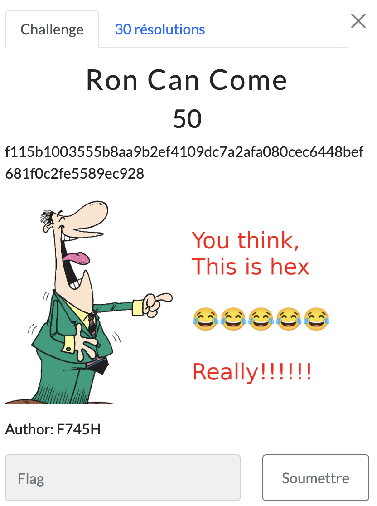

# Ron Can Come

> Level: xxx || 50 points

## 1. Data

> Instruction




## 2. Solution

After running around in circles for a while on this challenge, inspiration came to me while analyzing the title. Putting together the capital letters R, C, C., I guessed that RCC probably stood for **RC2 encryption**.

Armed with my new lead, I used [CyberChef](https://cyberchef.org/#recipe=RC2_Decrypt(%7B'option':'Hex','string':''%7D,%7B'option':'Hex','string':''%7D,'Hex','Raw')&input=ZjExNWIxMDAzNTU1YjhhYTliMmVmNDEwOWRjN2EyYWZhMDgwY2VjNjQ0OGJlZjY4MWYwYzJmZTU1ODllYzkyOA), my favorite tool for this kind of puzzle, to decrypt the content with RC2.


Mission accomplished after a lot of thought, but the solution was simpler than it looked!


## 3. Flag

```text
ThunderCipher{R1v35t's_C0d3}
```
