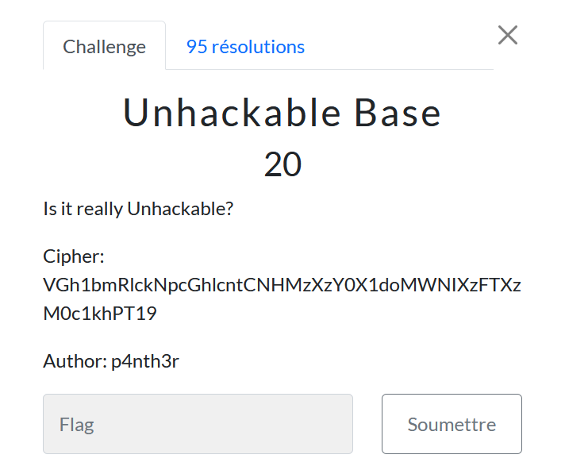

# Unhackable Base

> Level: xxx || 20 points

## 1. Data

> Instruction



## 2. Solution

Use [Cyberchef](https://cyberchef.org/#recipe=From_Base64('A-Za-z0-9%2B/%3D',true,false)&input=VkdoMWJtUmxja05wY0dobGNudENOSE16WHpZMFgxZG9NV05JWHpGVFh6TTBjMWtoUFQxOQ) to solve this challenge by choosing the `From Base64` operator.


## 3. Flag
    
```text
ThunderCipher{B4s3_64_Wh1cH_1S_34sY!==}
```