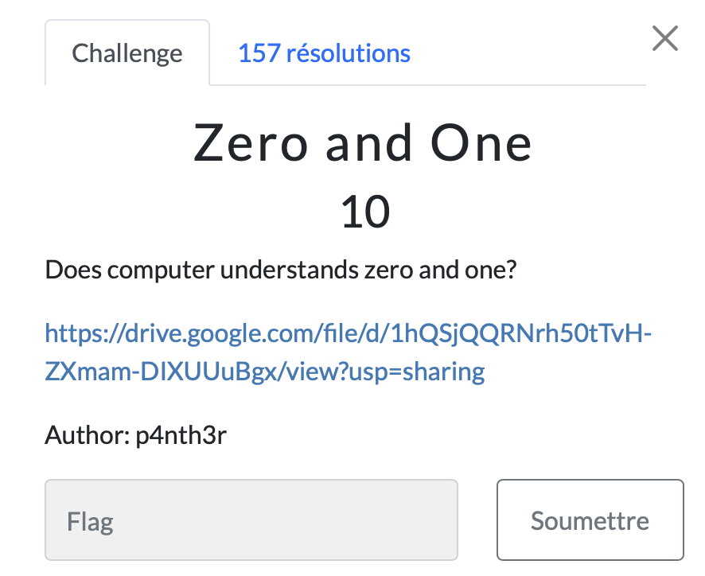

# Zero and One

> Level: xxx || 10 points

## 1. Data

> Instruction



> Resource

A [python file](https://drive.google.com/file/d/1hQSjQQRNrh50tTvH-ZXmam-DIXUUuBgx/view?usp=sharing) available via a Drive link

## 2. Solution

Use [dcode](https://cyberchef.org/#recipe=From_Binary('Space',8)&input=MDEwMTAxMDAgMDExMDEwMDAgMDExMTAxMDEgMDExMDExMTAgMDExMDAxMDAgMDExMDAxMDEgMDExMTAwMTAgMDEwMDAwMTEgMDExMDEwMDEgMDExMTAwMDAgMDExMDEwMDAgMDExMDAxMDEgMDExMTAwMTAgMDExMTEwMTEgMDEwMDAwMTAgMDAxMTAwMDEgMDExMDExMTAgMDAxMTAxMDAgMDExMTAwMTAgMDEwMTEwMDEgMDEwMTExMTEgMDAxMTAwMDEgMDExMTAwMTEgMDEwMTExMTEgMDAxMTAwMDAgMDEwMTExMTEgMDAxMTAxMDAgMDEwMDExMTAgMDExMDAxMDAgMDEwMTExMTEgMDAxMTAwMDEgMDAxMDAwMDEgMDAxMDAwMDEgMDAxMTExMDEgMDAxMTExMDEgMDExMTExMDE) to solve this challenge by choosing the `From Binary` operator.


## 3. Flag
    
```
ThunderCipher{B1n4rY_1s_0_4Nd_1!!==}
```

