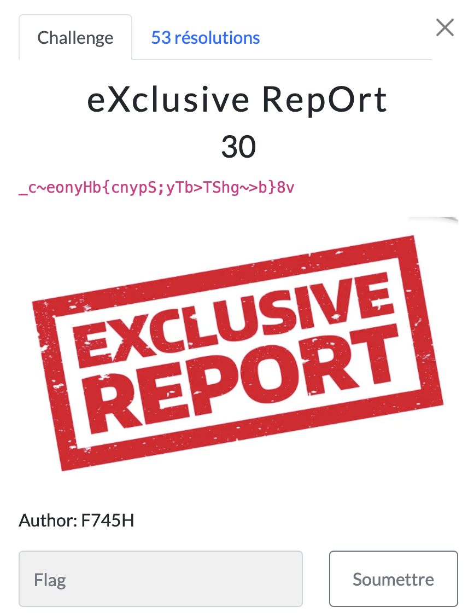

# eXclusive RepOrt

> Level: xxx || 30 points

## 1. Data

> Instruction



> Resource

```text
_c~eonyHb{cnypS;yTb>TShg~>b}8v
```


## 2. Solution

The challenge is to decrypt the given ciphertext. The ciphertext is encrypted using the XOR cipher. So why the XOR cipher? If you look closely at the challenge title `eXclusive RepOrt` you'll see three uppercase letters **XRO**, you can guess that the cipher used is XOR.
XOR is a logical operator that returns true if the two bits are different, and false otherwise.

To decrypt the message, simply XOR the encrypted message with the key. But we don't have a key, so we used Cyberchef's [XOR Brute force](https://gchq.github.io/CyberChef/#recipe=XOR_Brute_Force(1,100,0,'Standard',false,true,false,'')&input=X2N%2BZW9ueUhie2NueXBTO3lUYj5UU2hnfj5ifTh2Cgo&oeol=CR) to obtain the flag.


## 3. Flag

```text
ThunderCipher{X0r_i5_Xclu5iv3}
```
