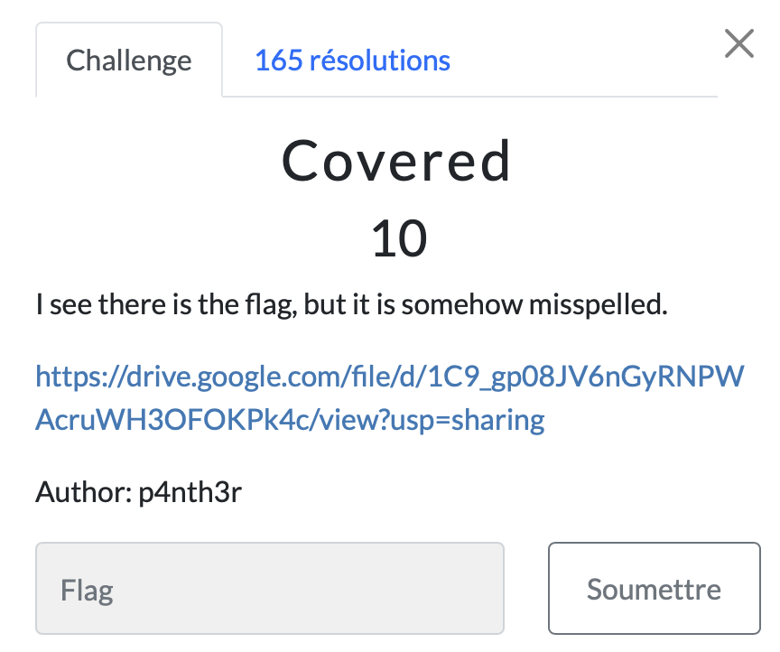

# Covered

> Level: xxx || 10 points

## 1. Data

> Instruction



> Resource

A zipped folder `dot.zip` (See Resource folder)


## 2. Solution


A very simple challenge ^v^...<br>
It was question to read files holding into the zipped folder.

First, I started reading the file named flag.txt but to my surprise it didn't contain anything so I opened the other files and paffff I got the flag.


## 3. Flag

```text
ThunderCipher{4lW4Ys_l00ks_F0r_H1dd3N_F1l3$}
```
