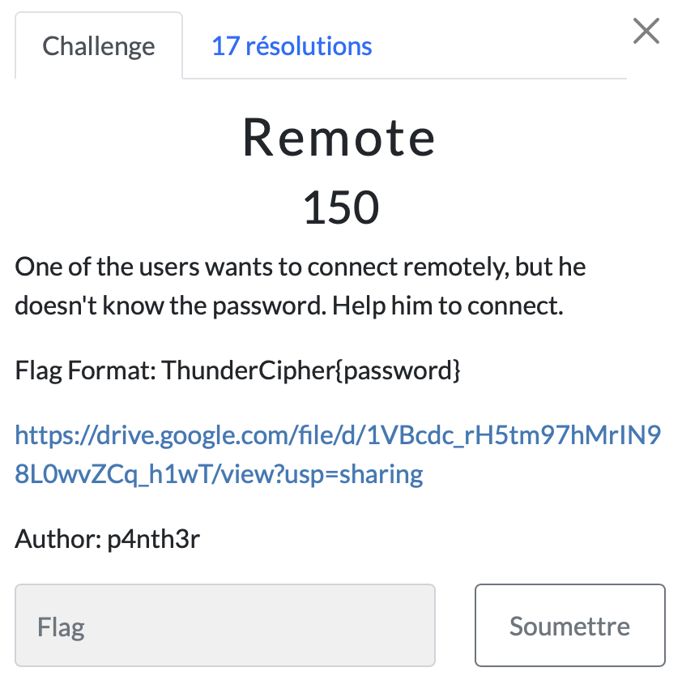

# Remote

> Level: xxx || 150 points

## 1. Data

> Instruction



> Resource

A packet capture file `remote.cap` (See Resources folder)

## 2. Solution

The task was to find the flag from the capture file. We can use Wireshark to analyze the file.

```bash
$ wireshark remote.cap
```

After opening the file, we can see that there are several IEEE 802.11 protocol packets. 
To find the password, we can use the `aircrack-ng` command. This is a suite of wireless network monitoring software whose main use is to “crack” the WEP (Wired Equivalent Privacy) and WPA (Wi-Fi Protected Access) keys of WIFI networks. These are protocols for securing Wi-Fi wireless networks.

We can use the following command to decrypt the wifi password from the BSSID (a MAC (hardware) address of the access point).
The BSSID value is obtained with the *wlan.bssid_resolved* filter.<br>


Explanation of options:
- `-b` : BSSID
- `-w` : Path to wordlist file


## 3. Flag
    
```text
ThunderCipher{football}
```
